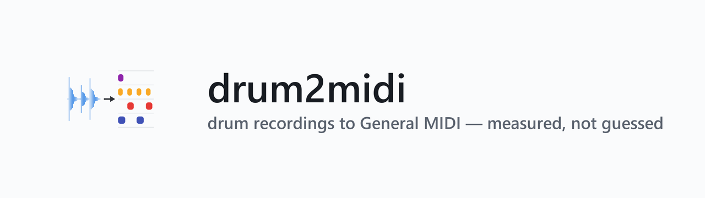
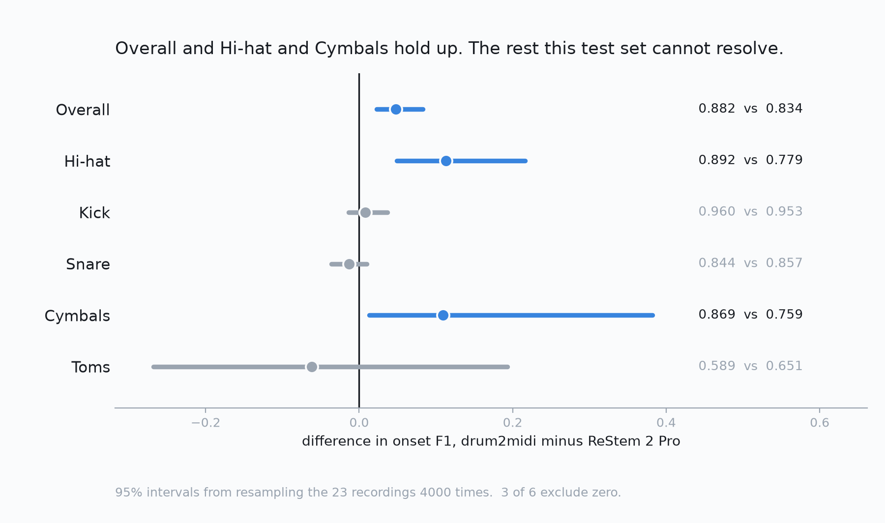
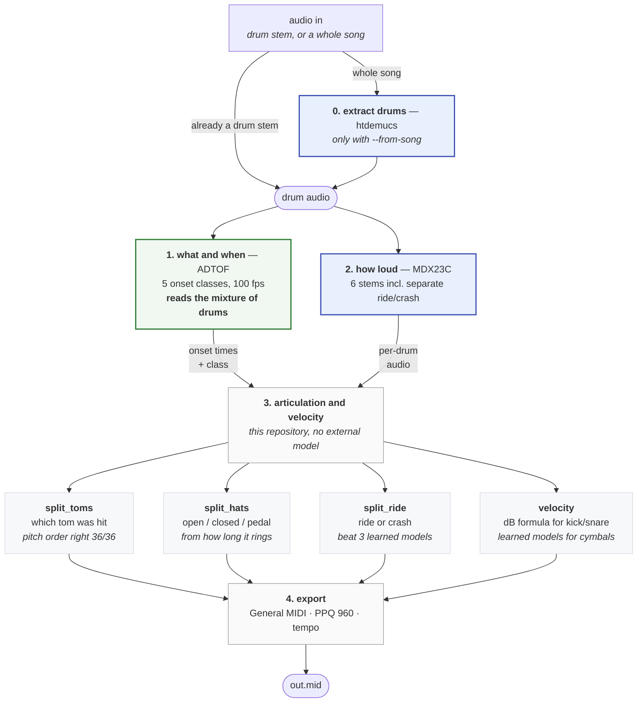
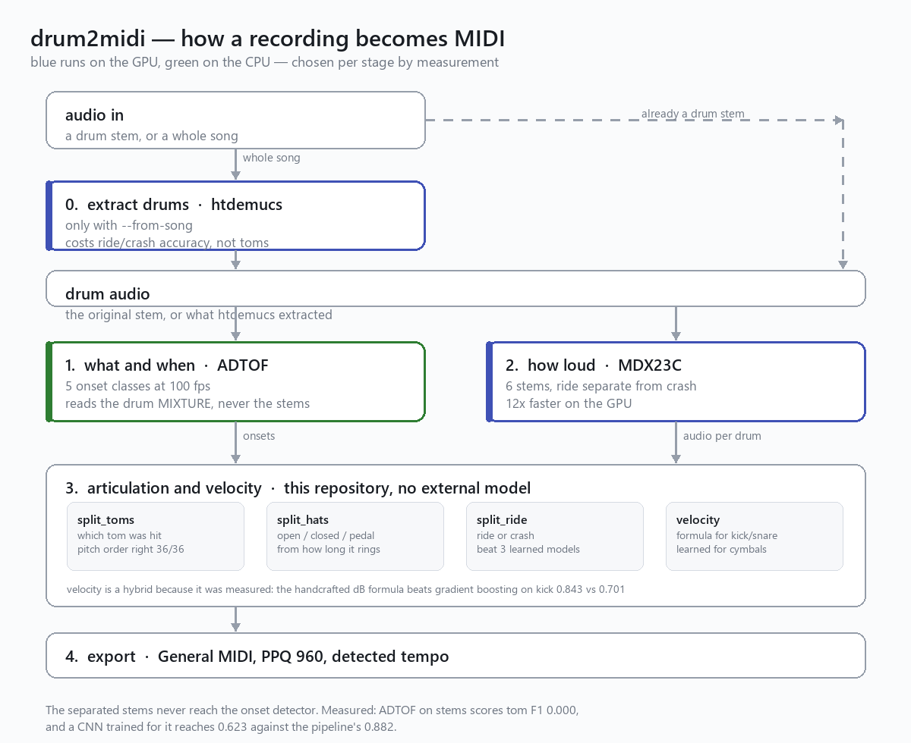
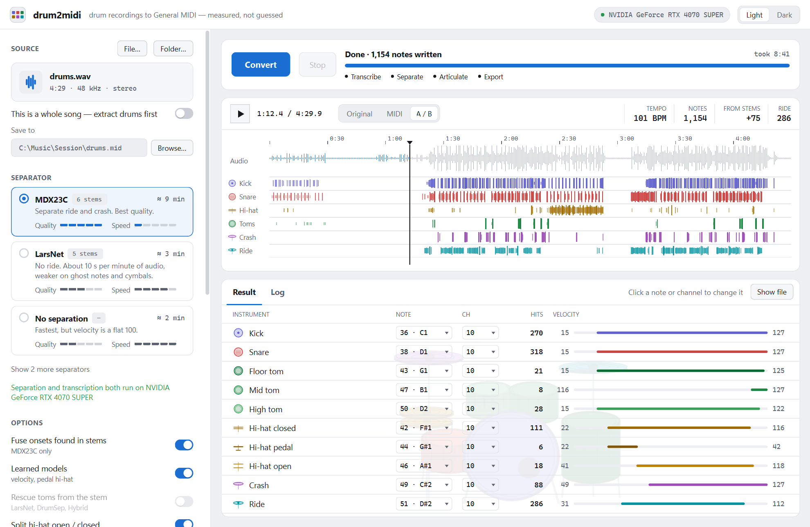
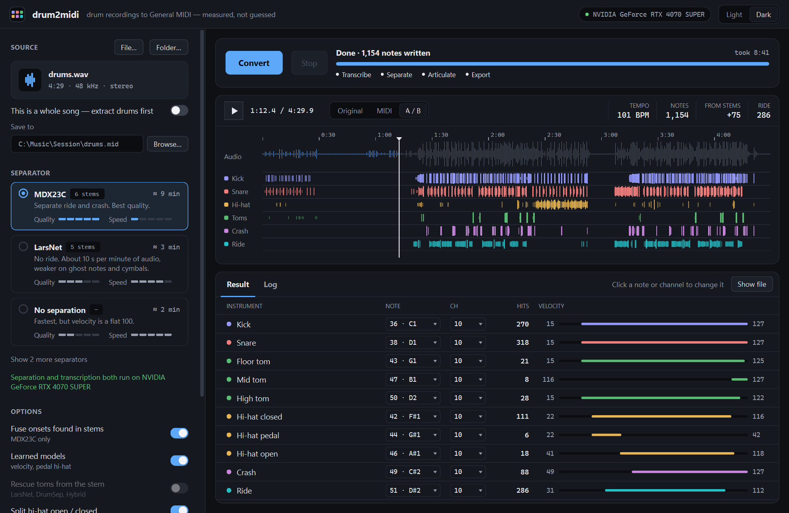

# drum2midi

[](https://github.com/miraer/drum2midi/actions/workflows/tests.yml)



Convert a mixed drum recording into MIDI, using only open-source models.

**An 80-second demo** — a conversion start to finish, the comparison below, and the parts
that were measured and thrown away:

https://github.com/user-attachments/assets/bd975252-bcd1-4494-be9c-3d4204996344

<sub>Captions are burnt in, and `docs/pitch.srt` carries them separately. The same file is
in the repository at [`docs/pitch.mp4`](docs/pitch.mp4) for anyone reading this outside
GitHub. The drum track is from the Groove MIDI Dataset, Magenta / Google, CC BY 4.0.</sub>

> **The video predates two corrections below and has not been re-cut.** Its chart was drawn
> against ReStem's weaker offline configuration: 0.820 where the current figure is 0.834, so
> the margin on screen is **+0.062** where the published one is now **+0.048**. It says two
> rows survive checking on MDB, which was true then — cymbals ran [−0.004, +0.373] and
> contained zero. Against the stronger mode that row clears zero, so three survive. The video
> also speaks only of the 23-recording corpus; the larger one says the two systems are level.
> The tables below are current. The video is kept as it was rather than quietly re-rendered,
> because it has been cited and a silently corrected recording is worse than a dated one.

**Measured against [ReStem 2 Pro](https://restemapp.com/restem2)** — a $199 commercial
product — on two hand-annotated corpora, in its best mode. **The answer depends on which
corpus you ask:**

| | MDB<br>23 recordings, 7 924 onsets<br>one production series | ENST-Drums<br>60 recordings, 18 814 onsets<br>3 drummers, 3 rooms |
|---|---|---|
| drum2midi | 0.882 | 0.837 |
| ReStem 2 Pro | 0.834 | 0.835 |
| **difference** | **+0.048** [+0.023, +0.083] | **+0.002** [−0.021, +0.027] |
| | we are ahead | **indistinguishable** |

On the smaller corpus we are ahead and the interval clears zero. On the larger one — two
and a half times the onsets, three kits in three rooms rather than one production series —
the two systems are **level**, and the honest word is indistinguishable rather than "ahead
by 0.002", because that interval comfortably contains a real loss. Both figures were
measured the same way, by the same scorer, against ReStem's best offline separation; the
two batches differ in one option, and [the table below](#the-same-comparison-on-a-larger-corpus-says-we-are-level)
says which. The disagreement between the corpora is not explained by that option — it is
worth +0.014 on MDB and nothing measurable on ENST. Neither figure is quoted anywhere
without the other.

One class goes clearly to ReStem and survives both bootstraps: **toms on ENST, −0.128
[−0.231, −0.011]** — our clearest measured weakness, and [described below](#the-same-comparison-on-a-larger-corpus-says-we-are-level)
rather than buried.

Per class on MDB, which is the corpus the rest of this section examines in detail:

| | drum2midi | ReStem 2 Pro | 95% CI on the difference |
|---|---|---|---|
| **Overall onset F1** | **0.882** | 0.834 | **[+0.023, +0.083]** |
| Kick | 0.960 | 0.953 | [−0.014, +0.037] |
| Snare | 0.844 | 0.857 | [−0.036, +0.010] |
| Hi-hat | **0.892** | 0.779 | **[+0.049, +0.216]** |
| Cymbals | **0.869** | 0.759 | **[+0.013, +0.382]** |
| Toms | 0.589 | 0.651 | [−0.268, +0.193] |
| Ghost notes (recall) | 0.718 | 0.747 | — |
| Ride vs crash | 0.917 | 0.953 | — |
| Hi-hat articulation | 0.690 | 0.691 | — |

> **This table was restated on 20 September and the earlier one flattered us.** Every
> figure above had been measured with ReStem in **Better (Offline)**, which is not its
> best setting. All three of its offline modes have now been rendered across all 23
> recordings on the same machine: Better and Best (Offline) are **byte-identical on every
> track**, but **Best + Bleed Reduction is genuinely better for ReStem** — 0.834 against
> 0.820. Our margin drops from +0.062 to **+0.048** and the hi-hat margin from +0.139 to
> +0.113. One row moved the other way: cymbals now clears zero. The comparison is against
> their strongest configuration from here on, and the weaker number is not quoted anywhere
> without this note.



*Drawn by `plot_comparison.py` from `significance.py`'s own output, so the picture cannot
drift from the table. The last three rows have no interval and are not plotted.*

### The same comparison on a larger corpus says we are level

That table is MDB. On **ENST-Drums** — 60 recordings declared before anything was
rendered, 3 drummers, 18 814 onsets against MDB's 23 recordings and 7 924 — the same
competitor, scored by the same code, comes out **level**:

| | MDB, 23 recordings | ENST, 60 recordings |
|---|---|---|
| ReStem's mode | Best (Offline) + Bleed Reduction | Best (Offline), no Bleed Reduction |
| onsets | 7 924 | **18 814** |
| sources | one production series | 3 drummers, 3 rooms |
| **MICRO, ours − theirs** | **+0.048** [+0.023, +0.083] | **+0.002** [−0.021, +0.027] |
| hi-hat | +0.113 [+0.049, +0.216] | +0.015 [−0.015, +0.048] |
| cymbals | +0.109 [+0.013, +0.382] | +0.056 [−0.018, +0.128] |
| snare | −0.013 [−0.036, +0.010] | +0.007 [−0.025, +0.045] |
| kick | +0.007 [−0.014, +0.037] | −0.029 [−0.079, +0.016] |
| **toms** | −0.062 [−0.268, +0.193] | **−0.128 [−0.231, −0.011]** |

**The two columns are not in the same ReStem mode, and that is stated rather than implied.**
The batches were simply run that way. It is not what makes the corpora disagree: Bleed
Reduction is worth +0.014 to ReStem on MDB and **+0.003 [−0.001, +0.008]** on the 36 ENST
recordings held in both modes from the two kits where it behaves — no difference measured.
By class, kick (+0.004 [+0.001, +0.008]) and cymbals (+0.011 [+0.003, +0.019]) clear zero,
but that is two of six uncorrected intervals, over recordings from only two kits, so neither
is claimed.
It matters for one row only. The option empties drummer 1's kick entirely, and that kit is
24 of these 60 recordings, so an ENST column rendered with it on would have a kick row that
looks nothing like this one. `restem_bleed_enst.py`.

**The honest word for the ENST column is "indistinguishable", not "ahead by 0.002".** The
interval runs from −0.021 to +0.027 and comfortably contains a real loss. Nothing here
retracts the MDB figure — both were measured correctly — but the two corpora disagree, and
the one that disagrees is two and a half times larger, drawn from three kits in three rooms
rather than one production series. A reader is entitled to know that the published headline
depends on which corpus was chosen.

**Toms are a real loss and the first difference on ENST that survives both bootstraps.**
−0.128, clearing zero over recordings and over drummers. It is not a handful of bad tracks:
of the 36 recordings carrying five or more annotated tom onsets, we lose on 23, win on 10
and tie on 3. The worst are not close — `110_solo_brushes` has a hundred annotated tom
onsets and scores 0.056 against ReStem's 0.779. Brush and mallet material is where our
adaptive tom threshold meets an activation distribution it was not designed against, and
that is upstream of any threshold tuning.

**The tie is an average of three different answers**, which is the same trap as every other
aggregate in this file:

| drummer | recordings | ours | ReStem | |
|---|---|---|---|---|
| 1 | 24 | 0.703 | 0.754 | −0.051 |
| 2 | 18 | 0.900 | 0.873 | +0.027 |
| 3 | 18 | 0.897 | 0.878 | +0.019 |

Ahead on two kits, behind on the hardest one. No cell there is individually resolved.

Method: our side runs the shipped pipeline with separation; theirs is Best (Offline), the
arm without Bleed Reduction. That option removes drummer 1's kick entirely on this corpus,
so a comparison against it would be measuring that fault rather than the separator — it is
written up for ReStem and will appear here once they have had it from us first.
`score_enst_restem.py`; the declared sample is scored separately from anything else that
finished, and both intervals are reported because the recording and the drummer are
different units of variation.

**Only three of those rows mean anything.** The intervals come from resampling the 23
recordings 4000 times (`significance.py`), and every row whose interval contains zero is
a difference this test set cannot resolve. The overall win is real, and it is carried
almost entirely by the hi-hat. The per-class rows for kick, snare and **toms** are not
evidence of anything: MDB holds just **90 tom onsets, 1.14% of the set**, so the tom
interval is ±0.23 and spans both directions.

**And +0.048 is not a general superiority.** Read down the table rather than across it:
we win the hi-hat and the cymbals clearly, ReStem wins the snare and the toms by smaller
and unresolved margins, and the kick is a wash. A single aggregate figure invites the
reading that one system is better at drums; what these 23 recordings show is that one is
better at cymbals and hi-hats on this material and the other is not worse anywhere it
matters. The second machine, scoring the same renders with an independently written
scorer, reached the same shape. On ENST even that narrower claim weakens: the hi-hat and
cymbal margins shrink to within noise and the tom margin hardens into a real loss.

> **⚠ These are our measurements of someone else's product, and they may be wrong.**
> ReStem's developers were not involved in any of this and have not reviewed it. We are
> not neutral parties — we measured a competitor to our own work, using software we had
> to learn from the outside.
>
> The hi-hat row, which carries the overall win, is a **precision** difference: they find
> nearly as many real hi-hats as we do and emit far more false ones. It is not an
> articulation difference — on MDB's open/closed/pedal labels the two systems tie at
> 0.691 and 0.690. [The detail, including a claim withdrawn from this
> section](#where-each-side-wins).
>
> **Both sides have a control like that, and neither was touched — but they are not the
> same control, and on this material one of them does nothing.** Each ReStem stem has its
> own trigger editor with **Thresh** defaulting to −60.0 dBFS, a level gate. We have no
> level gate at all: emission is decided by a peak-picking threshold on ADTOF's per-class
> sigmoid output — dimensionless, 0 to 1 — and a quiet hit is clamped to the lowest
> velocity rather than dropped. One asks how loud the signal is, the other how sure the
> model is, and the two numbers cannot be mapped onto each other.
>
> How much that architectural difference matters is measurable, so it was measured
> (`level_gate.py`). Across all **8504 notes** we emit on MDB, the quietest sits at
> **−56.5 dBFS** and the median around −15. **Not one falls below −60**, so a gate at
> ReStem's default would not have removed a single note of ours. On this material it is a
> noise-floor guard, not a sensitivity control.
>
> Neither side was tuned for this comparison either: **our hi-hat threshold is 0.22, stock
> ADTOF, not a value we chose.** The only class where our default departs from upstream is
> snare, and snare is a row where the two systems are indistinguishable.
>
> What remains genuinely unknown is whether a competent ReStem user works at −60.0 dB or
> raises it. We have asked, and undertaken to re-run all 23 recordings at whatever they
> say.
>
> **Its best mode is now the one measured, and it was not before.** These figures use
> Best (Offline) + Bleed Reduction. All three offline modes were rendered across all 23
> recordings on one machine: Better and Best (Offline) came out byte-identical on every
> track, so that pair is settled, and Bleed Reduction is worth +0.014 MICRO to ReStem on
> these 23 MDB recordings. On ENST it buys nothing measurable, +0.003 [−0.001, +0.008]
> over 36 recordings.
> The earlier published figure of 0.820 was its weaker configuration and has been
> restated rather than quietly replaced.
>
> The ReStem team were written to on **22 September 2026** — after this was already public.
> Publication was deliberately not made to wait on the letter, so they heard about it from
> here first and from us second. That is a choice with a cost and it was ours. The letter
> states plainly that this is public, gives every result with its interval, and says which
> of them are significant and which are not. No reply yet. If they say the product was used
> incorrectly, these numbers get rerun and corrected here, and the correction gets stated
> plainly rather than quietly edited in. That has already happened repeatedly with our own
> claims — six times in this very section.

<sub>Same 23 MDB Drums tracks, same `mir_eval` code, same 50 ms MIREX tolerance, both
given the isolated drum recording. ReStem was driven through its own interface
(`restem_ui.ps1`) and the `trigger_events.json` it writes was converted to MIDI by
`restem_to_midi.py`. That conversion is checked against ReStem's own MIDI exports
(`compare_restem_export.py`): on a render with every stem's MIDI OUT enabled it
reproduces their export **note for note including velocity** — kick 63, snare 123, closed
hat 158, pedal hat 7, mid tom 2, crash 6, all identical. This line used to add that three
further notes on the unscored `other` stem did not line up and could no longer be checked.
That was our error, not theirs: the two files came from renders 74 minutes apart and
ReStem overwrites its export directory each time. A second render with the JSON and the
MIDI captured from the same run matches exactly — **123 events, 123 notes, identical in
time, pitch and velocity**, and no pitch 60 in it at all. **None of the 23 benchmark
recordings produce any `other` events**, so nothing in the table above ever depended on
it. Nothing was extracted from its model files. Reproduce with
`compare_with_restem.py` and `significance.py` —
[full methodology and where each side wins](#comparison-with-restem-2-pro).</sub>

On a second, independent corpus — all 95 files of IDMT-SMT-Drums, 7927 onsets — the same
settings score **0.935**, so this is not tuned to one dataset. ReStem has since been run
on ENST-Drums as well — 60 recordings declared before anything was rendered, three
drummers, 18 814 onsets — so the *comparison* no longer rests on 21.8 minutes from a
single production series. It rests on both, and the two disagree: the margin is +0.048 on
MDB and +0.002 on ENST. What MDB alone does and does not threaten is measured in
`corpus_representativeness.py`; what the two corpora together say is in the table at the
top, and the larger one is the one that says we are level.

Every number in this README comes from a script in this repo. Negative results are
reported next to positive ones — a dozen ideas that sounded good were measured and
thrown away, including four tried this week, and each one is documented below with the
measurement that killed it.

---

## How it works



Blue stages run on the GPU, green on the CPU — measured per stage rather than assumed,
because convolution is 12x faster on the GPU while ADTOF's recurrent layers are 4.1x
slower there. See "Which device runs what".

<details>
<summary>The same diagram as an image (for editors that do not render Mermaid)</summary>



Regenerate with `python make_diagram.py`; it is drawn from code so it cannot drift out
of date silently.
</details>

| Stage | What it produces | Model |
|---|---|---|
| 0 (optional) | whole song → drum stem | htdemucs (Demucs v4) |
| 1 | **what and when** — 5 onset classes | [ADTOF](https://github.com/MZehren/ADTOF) via [ADTOF-pytorch](https://github.com/xavriley/ADTOF-pytorch) |
| 2 | **how loud** — separated stems | MDX23C DrumSep / [LarsNet](https://github.com/polimi-ispl/larsnet) |
| 3 | articulations — tom pitches, open/closed hats, ride vs crash | stem analysis in this repo |
| 4 | tempo + General MIDI export | librosa + pretty_midi |

The two branches matter. **ADTOF looks at the drum mixture, not at the separated
stems** — that is the single most counter-intuitive design decision here, and the
separator's output never reaches the onset detector. Running ADTOF on stems scores tom F1
0.000, and a handwritten amplitude trigger did no better, so for ADTOF the context of the
other drums is worth more than isolation. A third test, a purpose-trained CNN, used to be
quoted here as 0.623 against the pipeline's 0.882, but that compared two scorers rather than
two detectors and is withdrawn. Measured properly, on toms, a detector trained on E-GMD stems
loses to the shipped pipeline by **0.204 [−0.274, −0.137]** on ENST. That is set out in the
section on the learned onset detector below. The other classes are not measured yet.

With `--from-song`, htdemucs runs first and **everything downstream uses its output** —
both the transcriber and the separator see the extracted drum audio, never the original
mix.

The division of labour is not a guess either. **The separator does not improve note
detection at all** (MICRO F1 0.861 with it, 0.862 without). Its entire value is in
velocity and articulation.

### Which note numbers come out

General MIDI allows several numbers for the same drum, so this is a real choice, and a
DAW or sampler has to recognise it. It was settled by counting what hardware emits:
`gm_note_survey.py` over 1150 Groove MIDI performances recorded from a Roland TD-11
(445494 notes).

| drum | we write | what the hardware uses |
|---|---|---|
| kick | **36** | 36 in **100%** of kicks, 35 in none |
| snare | 38 | 38 (82%), 40 (18%) |
| hi-hat | 42 / 44 / 46 closed / pedal / open | 44 (60%), 42 (36%), 46 (4%) |
| toms | 43 / 47 / 50 low / mid / high | 48 (42%), 43 (36%), 45 (13%) |
| crash | 49 | 55 (39%), 57 (31%), 49 (12%) |
| ride | 51 | 51 (85%) |

This corrected an earlier mistake: the kick used to be written as 35, which General MIDI
calls "Acoustic Bass Drum" while 36 is "Bass Drum 1". No performance in the survey used
35, and ReStem 2 Pro writes 36 as well. `--notes 35=35` restores the old numbering.

Toms and crash are left alone: those percentages reflect one Roland's pad assignment,
and 49 ("Crash Cymbal 1") is the conventional choice in software instruments.

Hi-hat articulation is written as **separate notes** (42/44/46) rather than as CC4 pedal
position. Any sampler understands note 46 as an open hi-hat; only some understand CC4.

`note_names.py` prints the full table, including the letter name each DAW gives it —
note 36 is called C1 in Cubase, Logic, Ableton and Reaper, C2 in scientific notation and
C3 in FL Studio, which is why the number is what gets written:

```
 MIDI  Cubase/Logic  scientific  FL Studio  drum            when
   36            C1          C2         C3  Kick            always
   38            D1          D2         D3  Snare           always
   42           F#1         F#2        F#3  Hi-hat closed   default hi-hat
   46           A#1         A#2        A#3  Hi-hat open     when the stem rings out
   44           G#1         G#2        G#3  Hi-hat pedal    --pedal
   43            G1          G2         G3  Tom low         2 or 3 toms resolved
   47            B1          B2         B3  Tom mid         single-tom choice
   50            D2          D3         D4  Tom high        3 toms resolved
   49           C#2         C#3        C#4  Crash           default cymbal
   51           D#2         D#3        D#4  Ride            --separator uvr
```

Everything goes to MIDI channel 10 (index 9). Remap with `--notes 36=35,49=57`, or move
a drum to its own channel with `--channels 36=3`.

---

## Install

**Python 3.10 to 3.13; use 3.12 if you have the choice.** The upper bound is not this
project's: `audio-separator` depends on `diffq-fixed`, which publishes wheels for
cp310–cp313 only, so on 3.14 pip falls back to a source build that fails and the default
separator cannot be installed at all. Its metadata claims `>=3.7.0`, which is why the
failure arrives as a compiler error inside a dependency rather than as a version check.
3.13 has a Windows wheel but no Linux one, so 3.12 is the safest everywhere and is what
CI runs.

```powershell
git clone https://github.com/miraer/drum2midi.git
cd drum2midi
python -m venv .venv
.\.venv\Scripts\python.exe setup_env.py
```

Run every command with the interpreter in `.venv`, not a bare `python`. On Windows a
bare `python` is usually the Store alias rather than the environment you just built, and
`setup_env.py` now prints the path it actually verified for that reason.

That installs the Python packages, clones ADTOF-pytorch (it is not on PyPI) and then
verifies the result. The MDX23C drum separator downloads itself on the first conversion
(~400 MB).

**If you have an NVIDIA GPU**, install a CUDA build of torch before or after the above:
the default wheel on Windows carries no CUDA, so the card sits idle and everything runs
on the CPU without saying why. `.\.venv\Scripts\python.exe devices.py` reports that when
it happens and names the card. Get the exact command from
[pytorch.org/get-started/locally](https://pytorch.org/get-started/locally/) — the CUDA
version in the index URL depends on your driver and is deliberately not quoted here,
because a hard-coded one in this file was three releases out of date the day it was
written.

**FFmpeg is also required**, and it is a program rather than a Python package, so
`pip` will not bring it in:

```powershell
winget install Gyan.FFmpeg     # then open a new terminal, so PATH is re-read
```

`brew install ffmpeg` on macOS, `sudo apt install ffmpeg` on Debian or Ubuntu.
audio-separator — the default separator — runs `ffmpeg -version` before it does
anything, so without it stage 2 of 4 cannot start. `--no-separate` skips separation
altogether and does not need it, at the cost of flat velocity.

`models/velocity.pkl` and `models/pedal.pkl` ship with the repository (2.3 MB). They are
scikit-learn pickles trained on the Groove MIDI Dataset by `train_models.py`; retraining
them would mean downloading 4.8 GB of data first. They are loaded by default and the run
says so when they are missing. `--no-learned` ignores them, and because unpickling
executes code, do not point the pipeline at a `models/` directory you did not build or
fetch from this repository.

Optional extras:

```powershell
.\.venv\Scripts\python.exe setup_env.py --with-larsnet   # the fast separator + weights
.\.venv\Scripts\python.exe setup_env.py --with-intel-gpu # Intel GPU: separation 12x faster
.\.venv\Scripts\python.exe setup_env.py --no-render      # skip FluidSynth + soundfont
.\.venv\Scripts\python.exe setup_env.py --check          # verify, install nothing
```

FluidSynth and a General MIDI soundfont (~40 MB) are installed by default, because the
window plays the MIDI and an A / B mix through them. On Windows both are downloaded
into `tools/`. On macOS and Linux only the soundfont is; FluidSynth comes from
`brew install fluid-synth` or `sudo apt install fluidsynth`, which setup prints rather
than runs. `--no-render` skips both when you will only use the command line.

`--check` reports which device each stage will use. If an Intel GPU is present but torch
cannot see it, the installer says so instead of silently running on the CPU.

### NVIDIA: run that install through the virtualenv, not a bare `pip3`

pytorch.org gives you the command as `pip3 install torch ...`. That is right in general
and wrong here: on Windows a bare `pip3` is usually the system Python, not `.venv`.

```powershell
.\.venv\Scripts\python.exe -m pip install --force-reinstall torch torchvision `
    --index-url <the URL pytorch.org gave you>
```

**Take the index URL from them and keep the `-m pip`.** Which CUDA version you want is
theirs to answer; which interpreter receives it is ours. Get the second half wrong and
the install still succeeds and still reports nothing wrong — it puts a working CUDA build
somewhere this project never looks, while `.venv` goes on holding `+cpu`. The symptom is
a GPU the operating system can see and torch cannot:

```
note: NVIDIA GeForce RTX 4070 SUPER is installed and is not being used.
      this torch has no CUDA support (torch 2.14.0+cpu). ...
```

`.\.venv\Scripts\python.exe devices.py` prints that, along with the exact command for
the interpreter it is running in. If torch reports `+cpu` there after an install that
looked like it worked, you installed into a different Python — check with:

```powershell
.\.venv\Scripts\python.exe -c "import torch; print(torch.__version__, torch.cuda.is_available())"
```

A CUDA build is named for it (`2.14.0+cu132`); a CPU one says `+cpu`.

<details>
<summary>Manual installation</summary>

```powershell
python -m venv .venv
.\.venv\Scripts\python.exe -m pip install -r requirements.txt

git clone --depth 1 https://github.com/xavriley/ADTOF-pytorch.git
.\.venv\Scripts\python.exe -m pip install -e ./ADTOF-pytorch

# optional: LarsNet weights, only for --separator larsnet
git clone --depth 1 https://github.com/polimi-ispl/larsnet.git
cd larsnet
..\.venv\Scripts\python.exe -m gdown "1U8-5924B1ii1cjv9p0MTPzayb00P4qoL" -O m.zip
Expand-Archive m.zip -DestinationPath . -Force; del m.zip; cd ..
```

</details>

<details>
<summary>Benchmark datasets (only needed to reproduce the measurements)</summary>

```powershell
# MDB Drums — 110 MB instead of 1.3 GB thanks to sparse checkout
git clone --filter=blob:none --no-checkout https://github.com/CarlSouthall/MDBDrums.git mdbdrums
cd mdbdrums
git sparse-checkout init --cone
git sparse-checkout set "MDB Drums/annotations" "MDB Drums/audio/drum_only"
git checkout master; cd ..

# IDMT-SMT-Drums — second, independent test set
curl.exe -sSL -o idmt.zip "https://zenodo.org/records/7544164/files/IDMT-SMT-DRUMS-V2.zip?download=1"

# Groove MIDI — velocity and articulation ground truth
curl.exe -sSL -o groove.zip "https://storage.googleapis.com/magentadata/datasets/groove/groove-v1.0.0.zip"
```

The GMD archive contains a macOS artefact named `Icon\r`, an invalid Windows filename
that makes `Expand-Archive` fail silently — extract with a filter that skips it.

</details>

---

## Usage

```powershell
$py = ".\.venv\Scripts\python.exe"

& $py drum2midi.py "drums.wav" -o out.mid              # drum stem in, MIDI out
& $py drum2midi.py "song.mp3"  -o out.mid --from-song  # whole song: extract drums first
& $py drum2midi.py "folder\"   -o "midi\"              # bulk: one MIDI per file
& $py drum2midi.py "drums.wav" --separator larsnet     # ~50x faster, lower quality
& $py drum2midi.py "drums.wav" --no-separate           # fastest, flat velocity 100
& $py drum2midi.py "drums.wav" --quantize 16 --tempo 120
```

Bulk mode reports progress and an ETA, and one bad file does not stop the run — which
matters when a folder takes hours at the default quality.

There is also a window: `drum2midi.bat` on Windows, `./drum2midi.sh` on macOS and
Linux. It has been used by hand only on Windows; on other systems only the offscreen
platform the tests use has run it.



It is a single window: settings on the left, and on the right the conversion, a
timeline of the recording with one lane per drum, and the results. Each separator card
shows its quality/speed trade-off and, once a file is chosen, its estimated runtime.
Options that do not apply to the selected separator are dimmed rather than silently
ignored. **Folder…** (or dropping a folder on the window) converts every file in it.

When a run finishes, the timeline shows every note that was written, read back from
the MIDI file itself. Click it to seek, and use **Original / MIDI / A / B** to listen.
A / B puts the recording in the left ear and the rendered MIDI in the right, which
makes timing drift and wrong drums obvious on headphones. MIDI and A / B are rendered
by `render_midi.py` through FluidSynth, which `setup_env.py` installs by default.

The channel and note map sits in the sidebar under **Options**, so it can be set before
a file is chosen: a note and a channel for every drum, **Reset to General MIDI**, and
**One channel each** (kick on 1, snare on 2 … ride on 10) for a sampler with one output
per channel. The result table edits the same map, so a note or a channel can also be
clicked in a row. Either way the change is passed as `--notes` / `--channels` on the
next conversion.

The window uses PySide6 (`pip install PySide6`, already in `requirements.txt`). There
is a dark theme too:



Each drum has its own colour, used in the results table, the timeline and the logo alike:


The colours run low to high through the kit — kick indigo, snare red, toms green,
hi-hat amber, crash violet, ride teal — so neighbouring drums stay distinguishable
under the common forms of colour blindness, where red/green pairs are the risk.
The icons are generated by `drum_icons.py`, not stored as hand-made files. The window
draws them beside every list of drums — the result table, the sidebar map and the
timeline's lane captions — in the same hues in the same order, retuned for each theme.
It also draws a kit in those theme colours (`drum_kit_art.py`), above the empty drop
zone and faintly behind the result table, so the picture doubles as the legend.
Without Pillow the icons are plain colour dots and the background is plain. The
screenshots above predate the icons, the kit and the sidebar map.

Check the result by ear (original left, transcription right):

```powershell
& $py render_midi.py out.mid --against drums.wav -o ab.wav
```

### Tests

```powershell
& $py test_smoke.py
```

19 self-contained checks that run in under a minute on synthesised audio: MIDI validity,
General MIDI note mapping, PPQ divisibility (triplets must land on whole ticks),
quantization grids, channel and note overrides, argument validation, feature extraction,
the standalone trigger, folder batch mode, that every script answers `--help` instead of
starting a long job, and that the GUI builds and assembles a correct command line.
These catch wiring breakage, not accuracy regressions — accuracy is measured by the
benchmark scripts.

`evaluate.py` sits between the two: it synthesises a drum loop with known ground truth
and scores the whole pipeline end to end, so it verifies that the thing actually works
without downloading a single dataset.

```powershell
& $py evaluate.py
```

### Speed

MDX23C is the default because of quality. On a CPU it is slow; on a GPU it is not:

| separator | CPU | Intel Arc GPU | a 4-minute song |
|---|---|---|---|
| `uvr` (default) | ~15x slower than real time † | **~1.9x slower** | 60 min → **~7.5 min** |
| `larsnet` | ~5x faster than real time | unchanged | ~50 s |
| `--no-separate` | ~3x faster than real time | unchanged | ~30 s |

† **Read the CPU column as one machine, not as "the CPU".** That 15x was measured on the
Core Ultra 7 laptop this project is developed on. The same separator on a Ryzen desktop
measured **2.1x slower than real time** — 562 s for 269.9 s of audio — which is a sevenfold
spread between two machines on the same work. Two points are not a table, so the figure
above is left as it was measured rather than averaged into something that describes
neither machine. The GPU column has the same caveat and the same excuse. This is the
caveat the ReStem section already applies to *their* timings; it belongs here too.

### How many CPU threads

PyTorch starts one thread per physical core. That is correct on a uniform CPU and
counterproductive on Intel's hybrid laptop parts. A Core Ultra 7 165H reports 16 cores,
but only **6 are performance cores** — the other 8 (plus 2 low-power) are efficient
cores running the same work several times slower. A parallel op splits the work evenly
and then joins, so the share that lands on an E-core holds up the whole layer.

Measured with the real ADTOF model, first on a machine that was also running benchmarks,
then again on an idle one:

| threads | 1 | 2 | 4 | **6** | 8 | 12 | 16 | 22 |
|---|---|---|---|---|---|---|---|---|
| busy machine, ms | 5673 | 2099 | — | **2089** | 4097 | 4945 | 5565 | 7941 |
| idle machine, ms | 2607 | 2140 | 1748 | **1553** | 4359 | 4750 | 1967 | 2222 |

6 threads wins both times, but **the size of the win depends on what else the machine is
doing**: 2.66x over torch's default of 16 under load, and 1.27x when idle. The honest
figure to quote is the idle one, 1.27x, because that is the condition a user converting a
single file is in. The earlier 2.66x was measured while a benchmark was running and is
kept here only to show how much contention distorts this kind of measurement.

The shape of the curve is stable across both runs and is the real finding: performance
collapses between 6 and 12 threads, exactly where work starts landing on E-cores.

So `cpu_threads.py` asks Windows for the per-core `EfficiencyClass`
(`GetLogicalProcessorInformationEx`) and uses the count of top-class cores. On a uniform
CPU every core reports the same class, nothing is overridden, and torch's default stands.
Override with `DRUM2MIDI_THREADS=8`.

```powershell
& $py cpu_threads.py      # what was detected
& $py bench_threads.py    # time it yourself
```

These numbers were taken while the machine was also building a training set, so the
absolute values are noisy; the ordering was consistent across repeats.

### Which device runs what

`--device auto` (the default) does not simply prefer the GPU, because the two neural
stages have opposite hardware profiles. Measured on this machine:

| workload | CPU | Intel Arc | |
|---|---|---|---|
| separator-like Conv2d stack | 86.7 ms | 23.8 ms | GPU **3.6x faster** |
| MDX23C over a whole track | 543.5 s | 44.7 s | GPU **12.2x faster** |
| GRU over a long sequence | 225.7 ms | 1378.8 ms | GPU **6.1x slower** |
| ADTOF, the real model | 1408.4 ms | 5731.3 ms | GPU **4.1x slower** |

A recurrent network is a chain of tiny dependent kernels — each step waits for the
previous one, so launch overhead dominates and an integrated GPU loses to the CPU.
Convolution over a spectrogram is the opposite. So the default splits the work:
**separation on the GPU, transcription on the CPU.**

**On NVIDIA it does not split**, and that is now measured rather than assumed. cuDNN
provides fused recurrent kernels that XPU and MPS do not, so `auto` sends both stages to
CUDA. This used to say the claim followed those libraries' documentation and had never
been run, because the machine above has no NVIDIA GPU. One has since reported in — an
RTX 4070 SUPER against a 16-thread Ryzen:

| workload | CPU | RTX 4070 SUPER | |
|---|---|---|---|
| separator-like Conv2d stack | 64.4 ms | 3.0 ms | GPU **21.8x faster** |
| MDX23C over a whole track | 562 s | 26.9 s | GPU **20.9x faster** |
| GRU over a long sequence | 124.5 ms | 2.1 ms | GPU **59.1x faster** |
| ADTOF, the real model | 4766.0 ms | 74.9 ms | GPU **63.6x faster** |

**The recurrent rows reverse sign.** On Intel Arc the GRU is 6.1x slower on the GPU and
the real transcriber 4.1x slower, which is why the default splits there. On CUDA the same
two workloads are 59x and 64x *faster*. Nothing about the model changed; the fused
kernels are the whole difference, and sending transcription to CUDA is correct.

End to end on a 269.9-second drum recording, both stages on CUDA, best of three runs
(38.2 s, 39.2 s, 39.8 s):

| stage | | share |
|---|---|---|
| 1 transcribe (ADTOF) | 1.6 s | 4% |
| 2 separate (MDX23C) | 26.9 s | **68%** |
| 3 velocity and articulation | 8.5 s | 22% |
| 4 write MIDI | 0.6 s | 2% |
| **total** | **38.2 s** | **7.1x faster than real time** |

The same four stages on the CPU come to about **10 minutes** — 6.5 s, 562 s, 31.3 s,
0.5 s. That is a sum of separately measured stages rather than one timed run, so it is
quoted to the minute. Separation is the whole story in both columns: it is 68% of the
GPU run and 94% of the CPU one.

Two things about how these were taken. The separation figure was measured twice, once
on a busy machine and once on an idle one, and came back at **562 s both times** —
unlike the thread-count measurements above, this one does not care what else is
running. And the CPU column only exists because `--device cpu` now reaches the
separator at all: it used to stop before it, so the same measurement came back as
26.6 s of separation that was quietly still running on CUDA.

This is one machine and one GPU. `bench_devices.py` will tell you in a minute what your
own does, and a contradicting result is worth an issue.

The GUI reports whichever mapping applies rather than assuming the split; an earlier
version printed "transcription stays on the CPU" unconditionally, which was wrong on
every NVIDIA machine.

End to end on a 37-second file: 318 s on the CPU, **70 s** with the split. The output is
not approximately the same, it is *the same* — 126 notes, every onset matched, maximum
velocity difference 0, maximum timing difference 0.000 ms (`compare_midi.py`).

```powershell
& $py devices.py          # what this machine offers and what will be used
& $py bench_devices.py    # time each stage on each device yourself
& $py drum2midi.py drums.wav -o out.mid --device cpu   # force one device
```

**What about the NPU?** This machine has one (Intel AI Boost), and reaching it requires
OpenVINO rather than torch. Measured on both stages, the answer is no for transcription
and a qualified yes for separation:

| | fastest available | notes |
|---|---|---|
| ADTOF, transcription | torch CPU | OpenVINO reaches 0.9x on the real model. A toy GRU suggested 12–15x, which is why toys are not evidence |
| MDX23C, separation | OpenVINO GPU, **1.82x** over the torch XPU path | and the NPU reaches 1.36x, the first thing the NPU has won here |

Not adopted. The separator's STFT front-end cannot be exported to ONNX at all — complex
tensors have no ONNX type — so only the convolutional body crosses, the rest stays in
torch, and the end-to-end gain is smaller than 1.82x. The GPU result also differs from
torch by 0.24%, and what that costs in onset F1 is not measured.
`bench_mdx_openvino.py` reproduces all of it, [with the full
table](ROADMAP.md#smaller-and-specific).

Intel GPUs need the XPU build of PyTorch, which is not what `pip install torch` gives
you by default:

```powershell
.\.venv\Scripts\python.exe -m pip install --force-reinstall --no-deps torch torchvision `
    --index-url https://download.pytorch.org/whl/xpu
```

CUDA is used for both stages when present, because cuDNN has fused recurrent kernels
that XPU and MPS lack. That followed those libraries' documented behaviour rather than a
measurement until an RTX 4070 SUPER reported in: the transcriber is 63.6x faster on CUDA
there, against 4.1x slower on this Intel GPU. [The
numbers](#which-device-runs-what).

Transcription is a once-per-song operation, and the quality gap is large
(ride/crash 0.139 → 0.917). If you need speed without a GPU, `--separator larsnet` is
still there. The GUI shows the estimated time, and which device it will use, before you
start.

---

## Accuracy

### MDB Drums — 23 real miked recordings, 7924 hand-annotated onsets

Scored with `mir_eval` at the 50 ms MIREX tolerance.

| Instrument | reference | F1 | Precision | Recall |
|---|---|---|---|---|
| Kick | 1539 | **0.960** | 0.951 | 0.970 |
| Snare | 2654 | 0.844 | 0.821 | 0.868 |
| Toms | 90 | 0.589 | 0.493 | 0.733 |
| Hi-hat | 2639 | **0.892** | 0.860 | 0.928 |
| Cymbals | 1002 | **0.869** | 0.815 | 0.930 |
| **MICRO** | 7924 | **0.882** | 0.853 | 0.914 |

Best tracks: Hendrix 1.00, Disco 0.99, Shadows 0.99. Worst: FreeJazz 0.62, Reggae 0.63 —
brushes and swing are the hardest material.

**About toms.** Only 90 of 7924 onsets in the set are toms — **1.1%**. Toms are rare in
real music, so models barely see them during training, and the measurement itself rests
on a small sample.

### IDMT-SMT-Drums — a second, independent test set

Everything above is tuned and measured on MDB Drums, which risks overfitting to one set.
IDMT-SMT-Drums is a different corpus (real, electronic and hybrid kits, 3 classes only),
all 95 mixes, 7927 annotated onsets:

| Instrument | reference | P | R | **F1** |
|---|---|---|---|---|
| Kick | 2179 | 0.991 | 0.960 | **0.975** |
| Snare | 1499 | 0.711 | 0.993 | 0.828 |
| Hi-hat | 4249 | 0.958 | 0.962 | **0.960** |
| **MICRO** | 7927 | 0.905 | 0.967 | **0.935** |

By recording type, and this is worth stating with its proportions, because they are
lopsided (`idmt_by_kind.py`):

| Subset | Files | Onsets | MICRO | What it is |
|---|---|---|---|---|
| RealDrum | 14 | 1289 | 0.938 | a real kit in a room |
| WaveDrum | 70 | 5589 | 0.937 | built from samples |
| TechnoDrum | 11 | 1049 | 0.922 | a drum machine |

**Three quarters of this corpus is synthetic**, so the obvious worry is that 0.935 is
flattered by easy material. It does not appear to be: real minus synthetic is **+0.003**,
95% CI [−0.023, +0.028] — not significant. The caveat is that RealDrum is 14 files, and
IDMT annotates only kick, snare and hi-hat, so this says nothing about toms or cymbals,
which are the classes we are actually weakest on.

An earlier version of this table reported **0.942** from the first 20 files. Running the
remaining 75 moved it to 0.935, so that subset was representative — unlike the stem
fusion experiment further down, where a small sample was badly misleading.

The score is higher than on MDB because IDMT has no toms or cymbals — the two hardest
classes. [What is actually inside every drum dataset we surveyed](docs/datasets.md),
including two published descriptions that turned out to be wrong.

**An honest caveat about the separator choice.** On this set the two separators are
almost tied: `uvr` 0.942 vs `larsnet` 0.939. The large advantage measured on MDB
(0.882 vs 0.860) comes mostly from toms, cymbals and ghost notes — none of which IDMT
annotates. So `uvr` is the right default for full kits, but if your material is just
kick/snare/hats, `larsnet` costs almost nothing and is 50x faster.

### ENST-Drums — the corpus that can actually measure toms

MDB holds 90 tom onsets, 1.14% of its annotations, and 16 of its 23 tracks contain none.
That is not enough to resolve anything about toms: a **+0.282** effect — nearly a doubling
of tom F1 — produced an interval containing zero. The corpus was not disagreeing with us,
it was unable to answer.

ENST-Drums is 210 musical recordings across three drummers. Those recordings carry 2617
tom onsets out of 44 425 annotated onsets — the dataset as a whole holds 2758 toms, the
rest falling outside the musical subset scored here. On the same `mir_eval` code and
50 ms window:

| | MDB (23 tracks) | ENST (210 recordings) |
|---|---|---|
| tom F1 | 0.589 | 0.539 |
| **95% CI half-width** | **±0.199** | **±0.067** |

**3.0× narrower.** A +0.10 change in tom F1 is now resolvable; on MDB it was not. The two
corpora do not disagree — ENST's figure sits inside MDB's interval, which is the cleanest
demonstration available that the old number was uninformative rather than wrong.

Both half-widths are bootstrapped the same way, same seed and same 4000 resamples, by
`significance.py --own-ci` and `benchmark_enst.py`. An earlier version of this table
printed **±0.272** and **±0.087** and called the ratio 3.1×. Neither figure was
recomputed after `TOM_CEILING` landed: the first was a constant nothing produced any
more, the second came from the pre-ceiling run. The ratio survived almost unchanged
because both were stale in the same direction, which is luck, not method.

One methodological difference to declare: the ENST runs use `wet_mix` **without
separation**, on the grounds that the separator provably does not move tom scores on MDB.
That claim was re-verified under `TOM_CEILING` rather than inherited from the run that
first established it: separated and `--no-separate` give bit-identical toms on MDB —
90 ref, 134 est, 66 matched, F1 0.589 — while every other class moves, MICRO by 0.022.
That makes the tom comparison across the two corpora sound, but it is not a like-for-like
MICRO comparison with the separated MDB figures.

Full five-class picture on ENST, current policy:

| | F1 |
|---|---|
| kick | 0.902 |
| hi-hat | 0.839 |
| snare | 0.833 |
| cymbals | 0.824 |
| toms | 0.539 |
| **MICRO** | **0.834** |

Toms remain the outlier here as on MDB, and the gap is larger — ENST's drum solos are
far more tom-dense than anything in MDB. Buying the instrument immediately paid for
itself: [it found that our tom threshold was capping its own
output](#-adaptive-tom-threshold-and-the-ceiling-it-was-missing-for-months).

**What the tom errors actually are, and why no threshold reaches them.** They are not
spurious detections. On ENST **93%** of false toms are real drum hits assigned the wrong
class, and on MDB **100%** — 68 of 68 in the shipped output, with no phantom at all. And
the confusion has a shape: it is with the other **membranes**, not with the kit in general.

| origin of a false tom | MDB, 68 false toms | ENST, 406 false toms |
|---|---|---|
| kick + snare, share of false toms | 88% | 91% |
| their share of all onsets | 53.5% | 59% |
| **lift** | **1.65×** | **1.54×** |
| hi-hat + cymbals, lift | 0.25× | 0.22× |

Metal is under-represented by more than half on both, while being the more common onset
class. The classifier has learned to tell a membrane from a cymbal and has not learned
which membrane. The claim rests on the ENST column and on the second machine's larger
sample — all 210 recordings, 849 misclassifications, membrane lift 1.45×, holding at
88/69/84% across the three kits while the snare share alone swings 58/38/38 and does not
survive the split. The MDB column is 68 events and corroborates rather than carries.

**But on ENST the gap is recall, and it is the only part of it that clears zero.**
Both systems on the declared 60, 1 401 annotated tom onsets, bootstrapped the same way as
everything else here:

| | ours | ReStem | difference | 95% over recordings | over drummers |
|---|---|---|---|---|---|
| tom precision | 0.597 | 0.514 | +0.083 | [−0.023, +0.207] | [−0.214, +0.120] |
| **tom recall** | 0.463 | 0.882 | **−0.420** | **[−0.509, −0.308]** | **[−0.560, −0.329]** |
| tom F1 | 0.521 | 0.650 | −0.128 | [−0.231, −0.011] | [−0.279, −0.096] |
| tom events emitted | 1 085 | 2 405 | | | |
| membrane lift among false toms | 1.54× | 1.39× | | | |

**Recall is the whole of it.** The apparent precision advantage does not clear zero under
either resampling, so we cannot claim the other half of the trade — only the deficit. We
find 46% of the toms in this corpus and they find 88%.

**Where the missed toms go.** 753 onsets go missing and each one falls into exactly one of
three mechanisms, checked in an order that makes the partition unambiguous
(`tom_recall_autopsy.py`):

| why a missed tom was missed | count | of misses |
|---|---|---|
| **rejected by the threshold** | **419** | **56%** |
| another class won | 253 | 34% |
| the model never responds | 81 | 11% |

Nothing lands in the picker's other two rejection paths — no tom is lost for failing to be
a local maximum or for being merged into a neighbouring pick. The model is genuinely
silent at only 11%.

So more than half the deficit is the decision stage discarding a response the model made.
That invites lowering the threshold, and the reason it does not work is visible in what
those onsets look like. The picker thresholds `act − moving_average(act, 100 ms)`:

| | n | raw activation | local mean | after subtraction | threshold |
|---|---|---|---|---|---|
| toms we do emit | 648 | 0.758 | 0.201 | **0.524** | 0.450 |
| rejected by the threshold | 419 | 0.594 | 0.221 | **0.326** | 0.450 |

Two things push them under at once. The model is **less confident** to begin with — 0.594
against 0.758 — and **more of that response is eaten by its own context**, 43% against 27%,
because a tom in a fill is preceded by 100 ms of tom. The rejected onsets are not strong
responses caught by a badly set cut; they are weaker responses in denser passages. Dropping
the cut far enough to admit a 0.326 admits everything else at that level too, which is
exactly what happens to MDB below.

Their false toms carry the same membrane bias ours do — 1.54× against 1.39× — so the
confusion described above is not something they solved and we did not. What separates the
two systems on this class is that they emit toms and we do not: more than twice as many
events, at a precision we cannot show is better than theirs. MDB cannot resolve any of
this, for reasons set out a few paragraphs below.

One sub-case is visible on MDB, which ships articulation labels: **ghost notes become toms
at 12%, against 3% for plain snare strokes**. A ghost note is a very quiet stroke with
almost no wire rattle and the drum's body tone dominant, which is what a tom sounds like.
E-GMD's snare velocities are bimodal — two modes with a clear trough, across nine drummers
and eight styles — so quiet strokes are a large share of what a snare does rather than an
ornament. That is a hypothesis about what the model was taught, not a measurement of
ADTOF's labels, and E-GMD is not ADTOF's training set.

**Five remedies aimed at the misclassification were measured and none survived**, which is
part of why this is written up as a limitation rather than fixed. None of them addresses
the recall gap, which on ENST is the larger of the two problems:

| | why it fails |
|---|---|
| lower the threshold | admits more of the same wrong drums |
| require the onset to fall on the beat grid | a misclassified hit is played in time — phase error 0.071 against 0.036–0.111 for correct hits |
| take the loudest activation instead of thresholding each class | at a false tom the snare column reads 0.057; it is not a close call the picker got wrong |
| treat an isolated tom as suspicious | false toms cluster **more** than true ones, 6% isolated against 20%, because ghost notes repeat every bar |
| confirm against the separated tom stem | fitted on MDB it looks decisive, 0.589 → 0.766; held out it gains **+0.006** on ENST and fitted on ENST itself it gains the same, so the separation is a property of MDB's isolated stems and not a policy |

`tom_failure_probe.py`, `grid_filter_probe.py`, `class_confusion_probe.py` and
`stem_confirm_validate.py` produce each of those rows.

**And the missed toms are not inaudible to the model.** At 239 missed ENST tom onsets the
raw tom activation has a median of **0.444**, against a threshold of 0.45, so the signal
is there and the cut sits just above it. The obvious inference — lower the cut — is wrong,
and the two corpora say so in opposite directions. Taking the threshold that is optimal on
ENST (0.16) and applying it to MDB, which was never used to choose it:

| tom threshold | emitted | matched | precision | recall | F1 |
|---|---|---|---|---|---|
| shipped adaptive policy | 134 | 66 | 0.493 | 0.733 | **0.589** |
| fixed 0.25 | 499 | 66 | 0.132 | 0.733 | 0.224 |
| fixed 0.16, the ENST optimum | 722 | 71 | 0.098 | 0.789 | **0.175** |

MDB holds 90 tom onsets in 23 recordings, 1.1% of its annotations; ENST holds 1 401 in
60, 5.8%. A cut low enough to catch a tom fill buries a corpus that barely has toms, which
is what `TOM_FLOOR` exists to prevent, and the adaptive policy is already the compromise
between them rather than a mistake on the way to one.

So what separates us from ReStem on this class is measurable on ENST and not on MDB, and
on ENST it is emission. They emit 1.72 tom events per reference tom and we emit 0.77. It
is tempting to call that a trade — their recall against our precision — but the precision
half does not clear zero, so the honest version is one-sided: they emit more and find far
more, and we cannot show we are paying less for it.

**MDB cannot say anything about this class and we should stop asking it to.** It holds 90
tom onsets in 7 of its 23 recordings. The corpus-level difference there is **−0.062
[−0.268, +0.193]** — the interval printed in the table at the top of this section — and it
amounts to **three matched events**, 66 against 69. Resampling only the tom-bearing tracks
gives [−0.198, +0.076]. The residue is two tracks disagreeing: ReStem takes `Beatles` by
six matches, we take `Grunge` by seven, and the other five sit near zero. Which sign the
corpus lands on is which of those two a resample happens to draw.

An earlier version of this paragraph read the same MDB numbers as "they beat us on
precision and recall at once — a gap rather than a preference", from 0.566/0.767 against
0.493/0.733. That is the three events above, stated as though it were a finding, with the
interval that refutes it already published twelve lines higher. The second machine caught
it. It is the exact failure the confidence-interval rule exists to prevent, made on the
corpus most likely to invite it.

The same caution applies to anything drawn from the pair: comparing tom F1 across the two
corpora, ours 0.589 and 0.521 against theirs 0.651 and 0.650, invites a story about whose
numbers are stable across material. One of those four figures carries an interval of ±0.23.
Two points, one of them that noisy, is not evidence of robustness in either direction.

The four kinds of recording are not the same material, and toms do not score the same
across them:

| kind | recordings | toms | tom F1 |
|---|---|---|---|
| phrase | 135 | 1057 | 0.629 |
| MIDI-minus-one | 36 | 247 | 0.604 |
| solo | 11 | 866 | 0.485 |
| minus-one | 28 | 447 | 0.414 |

Solos hold a third of the tom onsets in a twentieth of the recordings, and score below
the phrases — density is not the difficulty, the playing is.

**Soft beaters are a measured class failure, not an anecdote.** The run reported one
recording of 210 that transcribed to nothing at all — `048_phrase_afro_simple_slow_mallets`.
ENST names the beater in every filename, so the obvious hypothesis was checkable rather
than arguable (`enst_mallets.py`, scoring the cached transcriptions, no inference):

| beater | recordings | reference onsets | emitted | MICRO F1 |
|---|---|---|---|---|
| sticks | 160 | 36 582 | 33 520 | 0.873 |
| rods | 9 | 1446 | 1295 | 0.832 |
| brushes | 32 | 5490 | 4271 | 0.616 |
| **mallets** | **8** | **751** | **311** | **0.409** |

Mallets against every other beater: **−0.433, 95% CI [−0.660, −0.351]**, resampling
recordings. The gradient runs with how soft the attack is, and so does the share of
onsets that never get emitted at all — 92% of references are matched by an estimate under
sticks, 41% under mallets. The pipeline is built on onset detection and a mallet barely
has an onset.

Seven of those eight recordings are one drummer playing afro material, so the table above
confounds the beater with the repertoire. ENST has the same material played with sticks,
which separates them:

| | mallets | sticks | difference |
|---|---|---|---|
| afro | 0.347 (7) | 0.775 (10) | **−0.428, CI [−0.653, −0.323]** |

ENST contains **no** recording of one drummer playing one piece with two beaters — the
corpus assigns one beater per drummer per style — so that pairing cannot be made. The
second machine found the next best thing: a control confounded in the *opposite*
direction. Drummer 1 played all four beaters, so holding the player fixed and letting
the style vary is available (`enst_beater_within_drummer.py`):

| within drummer 1 | soft | sticks | difference |
|---|---|---|---|
| rods | 0.832 | 0.782 | +0.049 [−0.037, +0.150] |
| brushes | 0.554 | 0.782 | **−0.228 [−0.310, −0.128]** |
| mallets | 0.347 | 0.782 | **−0.435 [−0.679, −0.315]** |

**−0.433 holding style, −0.435 holding drummer.** Two controls whose confounds point in
orthogonal directions, agreeing to two thousandths. An effect that survives both is not
explained by either. Rods, which are barely softer than sticks, show no degradation at
all — the negative control the argument needed and did not have.

**Brushes are not mallets, though.** At every annotated onset the model's activation for
that onset's own class sits at a median of **2.18×** its threshold for brushes against
**0.50×** for mallets, and 76% of brush onsets clear their threshold against 37% of
mallet ones. Brushes are a class that is heard and scored badly; mallets are a class that
is largely not heard.

The class breakdown says what "scored badly" means, and the two beaters fail in opposite
directions:

| | sticks | brushes | mallets |
|---|---|---|---|
| notes emitted per annotated onset | 0.90 | 0.75 | **0.27** |
| …on the hi-hat channel alone | 0.85 | **1.71** | 0.28 |
| hi-hat precision | 0.947 | **0.367** | 1.000 |

Mallets under-fire on every class. Brushes under-fire on every class *except* the hi-hat,
where they emit 1.71 notes for every one played and only 37% are right. A brush **sweep**
across a snare head is sustained broadband noise, which is what a hi-hat looks like to
the model — so the brush failure is not deafness, it is a sweep being transcribed as a
stream of hi-hat notes.

That was measured without the separator, so the obvious objection is that a separator
would strip the sweep energy before ADTOF ever sees it. **It does not.** The same 32
recordings through the full pipeline, paired bootstrap over recordings:

| | no separation | with separation | difference |
|---|---|---|---|
| MICRO F1 | 0.616 | 0.663 | +0.047 [+0.014, +0.083] |
| snare F1 | 0.695 | 0.792 | +0.098 [+0.046, +0.150] |
| hi-hat F1 | 0.463 | 0.481 | +0.018 [−0.026, +0.079] |
| **hi-hat notes per onset** | **1.71** | **2.04** | **+0.328 [+0.187, +0.565]** |

Separation helps overall, and it helps the snare a lot — but it makes the hi-hat
over-firing measurably **worse**, because the separator routes the sweep into the hi-hat
stem rather than removing it. The failure is not an artefact of scoring on the mix.

The consequence is practical: **a lower threshold would help mallets and actively harm
brushes**, whose problem is already too many hi-hat notes. There is no shared "soft
beater" remedy, which is why [Limitation 6](#limitations) and [Limitation
7](#limitations) are listed as separate problems.

This is [the same deafness as Limitation 8](#limitations) with a name attached: where
that one describes passages inside a track, this is the material property that produces
them.

ENST is **CC BY-NC-ND**: evaluation only. Nothing here is trained on it and no derived
annotations are redistributed.

### Groove MIDI Dataset — velocity and articulation

GMD pairs performances with the exact MIDI the drum module produced, so it carries
ground-truth **velocity**, which MDB does not.

| | LarsNet | UVR MDX23C |
|---|---|---|
| MICRO F1 (onsets) | 0.904 | 0.870 |
| velocity r, kick | 0.70 | **0.81** |
| velocity r, snare | 0.81 | **0.99** |
| hi-hat articulation | 0.650 | **0.829** |
| ride vs crash | — | **0.977** |

Velocity correlation is computed **within each track** and then averaged: our velocities
are normalised per track, so pooling hits across tracks measures nothing (it drags kick
from 0.70 down to 0.53).

**Caveat:** GMD audio is Roland module output — samples with no room and **no mic bleed**.
Separation quality looks better here than it is. MICRO 0.904 on GMD vs 0.862 on the
real, miked MDB set is exactly that effect.

---

### Drum stem or whole song?

Both work — `--from-song` runs htdemucs first to pull the drums out of a full mix. MDB
Drums ships the same 23 recordings as isolated drums and as full band mixes with shared
annotations, so the cost of that extra stage can be measured directly:

| Instrument | reference | drum stem | whole song | delta |
|---|---|---|---|---|
| kick | 1539 | 0.960 | 0.923 | −0.037 |
| snare | 2654 | 0.804 | 0.776 | −0.028 |
| **toms** | 90 | 0.573 | **0.328** | **−0.245** |
| hi-hat | 2639 | 0.863 | 0.858 | −0.005 |
| cymbals | 1002 | 0.869 | 0.843 | −0.026 |
| **TOTAL** | 7924 | **0.860** | **0.834** | **−0.026** |

**Feeding a whole song costs about 0.026 F1 overall** — small, and mostly precision
(0.864 → 0.849) plus recall (0.855 → 0.819). Hi-hat barely notices (−0.005).

**Toms are the exception**: they nearly halve, 0.573 → 0.328. They are the quietest and
rarest part of the kit, so whatever htdemucs leaves behind hurts them most.

**The extractor was finally compared, and the choice turned out not to matter.** htdemucs
is what `audio-separator` offers first, and unlike every other component here it was
adopted without measurement — which was uncomfortable, because it sits on the weakest
path in the whole pipeline. The catalogue holds four models that emit a drums stem, and
their published SDR spans 1.5 dB:

| model | drums SDR |
|---|---|
| `htdemucs_ft` | **10.0** |
| `hdemucs_mmi` | 9.6 |
| `htdemucs` (default) | 9.4 |
| `htdemucs_6s` | 8.5 |

SDR is not this project's metric, so `compare_extractors.py` ran each of them over all 23
MDB full mixes, transcribed the result and scored the MIDI against the same annotations.
`score_extractors.py` reports it, and will score a run that was interrupted:

| extractor | MICRO F1 | 95% CI (bootstrap over tracks) |
|---|---|---|
| `hdemucs_mmi` | **0.8363** | [0.7764, 0.8927] |
| `htdemucs_ft` | 0.8339 | [0.7705, 0.8922] |
| `htdemucs` (default) | 0.8308 | [0.7654, 0.8920] |

**None of the gaps survive contact with statistics.** Resampling the 23 tracks 4000 times,
every pairwise difference straddles zero: htdemucs vs `hdemucs_mmi` is −0.0055 with a 95%
interval of [−0.0125, +0.0019]. The nominal ranking also disagrees with SDR, which put
`htdemucs_ft` first and `hdemucs_mmi` second — another reminder that separation quality
and transcription accuracy are not the same axis.

So the default stays `htdemucs`, now for a stated reason rather than by accident: nothing
measurably beats it. `--extractor hdemucs_mmi.yaml` selects another if you want to try.

The wider lesson is about this test set rather than about Demucs. A single extractor's
interval spans **±0.06**, so 23 recordings cannot resolve differences smaller than about
one point of F1 — and the individual claim being tested here is a tenth of that.

It also costs time: the 23 tracks took 12 minutes as stems and 111 minutes as songs,
because every file goes through the extractor first.

#### On a real commercial mix

MDB's "full mix" files are short excerpts, not finished productions, so the number above
could be optimistic. One 4½-minute song was available both as the finished stereo mix and
as the drum stem it was bounced from — the same audio, so the two runs are directly
comparable. There are no hand annotations here, so this measures **agreement with the
stem run**, not absolute accuracy:

| instrument | stem | song | recall | precision |
|---|---|---|---|---|
| kick | 270 | 257 | **0.941** | 0.988 |
| snare | 318 | 272 | 0.796 | 0.930 |
| hi-hat closed | 111 | 122 | 0.820 | 0.746 |
| **ride** | 286 | 175 | **0.598** | 0.977 |
| **crash** | 88 | 159 | 0.886 | **0.491** |
| toms (all) | 57 | 50 | 0.561 | 0.640 |
| **TOTAL** | 1154 | 1073 | 0.779 | 0.838 |

Agreement F1 **0.807**. Timing survives well (mean deviation 2.0 ms), velocity less so
(mean 7.8 of 127).

The interesting part is *where* it breaks. Kick is nearly untouched. What collapses is
the **ride/crash distinction**: ride drops to 0.598 recall while crash gains 71 notes it
should not have, and the two counts nearly cancel (374 → 334). Cymbals are broadband and
overlap with vocals and guitars, so htdemucs alters their spectrum most — and ride vs
crash is decided spectrally. Toms blur into each other the same way (low tom 0.286
recall, mid tom 0.348 precision).

**So: for kick and snare a full mix is fine. If cymbal articulation matters, feed a drum
stem.** This is the same conclusion MDB gave, but the damage is concentrated differently
— in toms there, in cymbals here.

So: if you have an isolated drum track, use it. If you only have the song, the result is
still usable, but expect tom fills to suffer.

## Comparison with ReStem 2 Pro

As far as I know there are no published accuracy figures for ReStem, so this is the first
symmetric measurement. Both systems were run over the same 23 MDB tracks and scored by
the same code (`compare_with_restem.py`).

**Read this section as what it is: one side's measurement of the other side's product.**
ReStem's developers had no part in it, have not reviewed it, and had no opportunity to
object before publication. Everything below was learned from the outside — from its
exports, its `trigger_events.json`, its interface and its published user's guide — by
people with an obvious stake in the answer. Eight specific reasons to hold it loosely:

- **A fifth of the headline rests on four tracks where ReStem emits no hi-hat at all.**
  `MusicDelta_Hendrix`, `MusicDelta_Reggae`, `MusicDelta_Rock` and `MusicDelta_Zeppelin`
  produce **zero** hi-hat events against 34 to 64 annotated onsets each — while kick and
  snare on those same tracks come back very nearly exact. It is not a mode effect: both
  offline arms are equally silent, so this is ReStem producing nothing on 17% of the
  corpus rather than a setting chosen badly. Corpus hi-hat recall of 89% hides it because
  nineteen live tracks absorb four dead ones. Dropping them, via
  `significance.py --exclude`:

  | | all 23 | the 19 |
  |---|---|---|
  | MICRO | +0.048 [+0.023, +0.083] | **+0.038** [+0.014, +0.066] |
  | hi-hat | +0.113 [+0.049, +0.216] | **+0.081** [+0.024, +0.160] |
  | cymbals | +0.109 [+0.013, +0.382] | +0.109 [+0.015, +0.323] |

  All three rows stay significant, so the conclusion survives the sensitivity analysis.
  But a fifth of the MICRO margin and over a quarter of the hi-hat margin is a failure of
  theirs rather than a quality difference, and the headline number does not say so. The
  second machine found this by asking a per-track question of a corpus figure that had
  already been checked and called clean.
- **Some rows rest on far fewer recordings than the table implies.** The onset counts are
  not the sample size. Toms appear in 7 of the 23 recordings and one of them carries a
  third of them; cymbals have 1,002 onsets but an effective sample of 4.5 recordings, with
  37% in a single track. Even hi-hat — the row carrying the headline — is 8.9 effective
  recordings, 27.6% of it one Disco excerpt. The bootstrap already reflects this, which is
  why the tom interval is [−0.313, +0.129], but any sentence that says "23 recordings"
  about a per-class row is saying more than is there. Measured by
  `corpus_representativeness.py`, which also drops each class's largest contributor and
  recomputes: every conclusion survives, and the hi-hat advantage *grows* from +0.139 to
  +0.173. So the result is not an artefact of one recording — and the tom and cymbal rows
  are still carried by about four apiece, which no robustness check can fix.
- **The corpus is 21.8 minutes long and comes from one place.** All 23 recordings are
  `MusicDelta_*` excerpts — one production series, median length 37 seconds, shortest 13.
  They are not 23 independent sources; drummer, room and engineer are unknown and
  plausibly shared, and nothing in the dataset lets anyone check. The bootstrap treats
  them as 23 independent draws because there is no other option, not because it is known
  to be true. `corpus_representativeness.py` reports this and tests what can be tested:
  regrouping the tracks by genre and dropping a whole genre moves the delta by at most
  0.015, against a published interval of ±0.032 — so *that* form of unrepresentativeness
  does not reach the answer. Which is a narrower reassurance than it sounds.
- **~~It has not been established that ReStem ran in its best mode.~~ Settled, and we
  were using the weaker one.** All three offline modes have now been rendered across all
  23 recordings on a single machine. Better and Best (Offline) are byte-identical on
  every track, so that choice never cost ReStem anything. Best + Bleed Reduction is a
  different matter on this corpus: it is worth **+0.014 MICRO to ReStem** across these 23
  MDB recordings, 0.834 against 0.820, and the
  published comparison had been measured against the weaker setting. The table has been
  restated. Two of the differences this changes are worth naming: Bleed Reduction gains
  ReStem the snare (0.845 → 0.857) and the hi-hat (0.754 → 0.779) and costs it the toms
  (0.699 → 0.651).
- **~~ReStem was never run on a second corpus.~~ It has been, and the second corpus
  disagrees.** This was the largest open hole in the comparison and closing it cost the
  headline. ReStem has now been rendered over 60 ENST-Drums recordings — declared before
  anything was rendered, three drummers, three rooms, 18 814 onsets against MDB's 7 924 —
  and the margin there is **+0.002 [−0.021, +0.027]**, level rather than ahead, with toms
  going to ReStem by −0.128 [−0.231, −0.011]. Both corpora are reported at the top with
  their sizes. What remains true is that ENST-Drums holds 210 recordings in total and the
  comparison uses 60 of them, and that the trial which made any of this possible has days
  rather than weeks left.
- **Articulation thresholds were left at their defaults.** ReStem's hi-hat and tom
  classification boundaries are user-adjustable, and the vendor documents adjusting them
  when articulations land on the wrong note. We adjusted nothing, which is a fair
  defaults-against-defaults comparison but is not a measurement of the model's ceiling.
- **The settings were reconstructed, not recorded.** The quality mode in use was
  established after the fact by matching exports event for event, on two tracks. The
  vendor documents Better and Best as different models; we observed identical MIDI from
  both on those two tracks, which is an observation about those tracks, not a general
  claim.
- **Anything to do with speed or memory is about this machine, not their software.** An
  Intel Arc system with no NVIDIA GPU is not the path their documentation points at, so
  no timing figure from here is quoted as a comparison.

What can be stated without qualification: nothing was extracted from their model files,
and nothing of theirs is redistributed. The ReStem team were contacted on **22 September
2026**; publication deliberately did not wait for it, so the letter followed the
publication rather than preceding it. Any correction they send gets applied here and
labelled as a correction.

Method: ReStem 2.0.18 on trial, driven through UI automation (`restem_ui.ps1`,
`restem_batch.ps1`). No weights were extracted — only the product's normal output.

**Which quality mode, and what is actually known about it.** ReStem offers Better
(Offline) and Best (Offline), the latter with an optional Bleed Reduction. The runs above
used Better, and that was not recorded at the time — the export does not carry the mode,
so it had to be established afterwards by re-transcribing tracks and matching the exports
event for event (`restem_one.ps1`, `compare_restem_runs.py`). What the evidence covers is
counted by `verify_restem_modes.py`, which hashes every render on disk:

| | MusicDelta_Rock_Drum | MusicDelta_Beatles_Drum |
|---|---|---|
| reference toms | 0 | **30**, the most in MDB |
| Better (Offline) | 0.500 | 0.931 |
| Best (Offline) | 0.500, byte-identical | 0.931, byte-identical |
| Best + Bleed Reduction | 0.466 | 0.915 |

Better and Best produced **identical MIDI** on both tracks checked — one with no toms and
one with the most. Only Bleed Reduction changed anything, and it lost on both: on Rock it
emits 7 toms where the reference has none; on Beatles it gains 0.009 on toms and loses
0.011 on snare.

**Say what that rests on, because it is less than it reads like.** Three tracks have been
rendered in both modes — FunkJazz at 367 events, Beatles at 123, Rock at 24. Every one
agreed byte for byte, with no differing byte anywhere. But 514 events is **5.6% of the
9,168 ReStem emitted across this corpus**, and 71% of that sample is a single recording.
"The mode does not reach the transcription" is a generalisation from three tracks, and it
is stated here as one. The other 20 recordings were rendered in Better and never rendered
in Best, so for those the claim is an extrapolation and nothing else.

**One thing that was not being looked for.** The same track rendered on different days is
also byte-identical — three such comparisons, all exact. ReStem's pipeline is
deterministic, which is why the mode agreement means anything at all: without it, two
renders agreeing would have been consistent with the output simply not varying much. That
result arrived as a by-product of re-rendering Beatles on 20 September for an unrelated
reason, and nobody had thought to check it.

**That identity was doubted here and then tested properly**, because the vendor documents
Better and Best as different models and byte-identical trigger events from both is an
extraordinary claim. The original evidence could not rule out that the selector had never
been applied: ReStem's guide describes a separate `Reprocess` action, so a cached result
re-emitted would advance the cache timestamp, satisfy the old guard and look exactly like
agreement.

So the test moved off the MIDI and onto the audio, since two different separation models
must produce different **stems** even where the trigger engine agrees
(`restem_mode_evidence.ps1`, `compare_mode_evidence.py`). On MusicDelta_FunkJazz — 49
seconds and 367 events, far richer than the 24-event track the claim first rested on —
with the mode read from the window before each render and the run refusing if it was
wrong:

| | Better (Offline) | Best (Offline) | Best + Bleed Reduction |
|---|---|---|---|
| input sha256 | identical | identical | identical |
| render time | 231.4 s | 163.9 s | 399.6 s |
| separated stems | — | **all 7 differ** | **all 7 differ** |
| `trigger_events.json` | 367 events | **byte-identical**, 367 | **differs**, 359 |

The modes are real and the separation genuinely changes. **On the three tracks rendered
both ways, TrigNet lands on exactly the same events** — its transcription appears
insensitive to the separation quality it is given. Three tracks is what that sentence is
worth; it is the reason to believe the comparison was not distorted by the mode, not a
proof that it could not have been.

The third column is the control, and it is the reason the second column can be trusted.
Bleed Reduction reaches the transcription where the quality selector does not: eight
fewer events, the difference falling on the snare, 130 against 123. So the capture is not
blind to event-level change — it detects it where it exists, which is what makes the
agreement between Better and Best a property of their trigger engine rather than an
artefact of our method.

Two caveats on the machine rather than the software. Their offline renderer wants around
5 GB for a 36-second track and swaps badly below that. And on this Intel Arc system it
computes through Vulkan; forcing it off — which was tried here on the strength of an older
note about a Vulkan crash — quadruples its memory to 20 GB and destroys its speed. Neither
affects accuracy, but both make timing figures from this machine untrustworthy.

Its engine writes `trigger_events.json`, which is the raw **TrigNet** output:

```json
{"format": "trignet-events-v1", "sr": 44100, "hop": 441,
 "stems": {"kick": [{"sample": 433, "prob": 0.928, "vel": 0.8968}],
           "hh":   [{"sample": 787, "...": "...", "cc4": -0.0475}],
           "toms": [{"sample": 181292, "tomClass": 2, "fundHz": 196.0}]}}
```

Two things are visible there: TrigNet runs at **the same 100 frames per second** as ADTOF,
and it classifies toms **by fundamental pitch** — the same approach as our `split_toms`.

### Where each side wins

Stated the way the evidence supports, rather than by reading off the bigger number:

**drum2midi is measurably better** at the hi-hat (0.892 vs 0.779, interval
[+0.049, +0.216]), at the cymbals (0.869 vs 0.759, [+0.013, +0.382]) and therefore
overall (0.882 vs 0.834, [+0.023, +0.083]). The overall win is still carried mostly by
the hi-hat. Those figures are against ReStem in Best + Bleed Reduction, its best mode;
an earlier version of this section used Better and reported a larger margin.

> **⚠ The hi-hat gap is over-firing, not articulation — and an earlier version of this
> box said otherwise.**
> ReStem finds nearly as many real hi-hats as we do (recall 0.893 against 0.928). The
> difference is precision: **0.652 against 0.860**. It emits hi-hat onsets that are not
> there, most visibly on jazz — 212 events against 7 in the reference on FreeJazz.
>
> On articulation the two systems are level. Scored against MDB's own open/closed/pedal
> labels, accuracy is **0.691 for ReStem and 0.690 for us** — a tie to within a
> thousandth. Their MDB exports contain 3113 closed, 370 pedal and 133 open hi-hats,
> across 12 of the 23 files.
>
> This box previously claimed their exports contained no open hi-hat at all and blamed a
> default threshold. That came from one song — a single recording where their export
> carried 188 note-42 and nothing else — generalised to the corpus without checking.
> Counting the files takes seconds (`count_restem_articulations.py`) and refutes it.
>
> What survives is narrower and still worth saying: ReStem's articulation boundaries are
> user-adjustable and we left them at their defaults, as we left ours. On this corpus
> that costs them the open class specifically — 37 correct of 251, against our 174 of
> 246 — while they take the pedal class no more successfully than we do. But articulation
> is scored separately from onset F1, so none of it explains the hi-hat row.
>
> **The defaults were verified rather than assumed**, by opening both trigger-range
> editors: the hi-hat shows 0.47 and 0.8 and the toms show 115, 155 and 210 Hz, which are
> the values their user's guide documents.
>
> The two panels differ in a way worth recording. Each **tom** note selector names its own
> range in accessibility help text — "auto-detected mid toms (155-210 Hz)" — so those
> boundaries can be read without opening anything. The **hi-hat** selectors name only the
> class: "auto-detected pedal hi-hats", no numbers. So the openness thresholds this
> section turns on are visible only by opening the editor and looking.
>
> An earlier version of this paragraph said the thresholds were nowhere in the tree at
> all. That was wrong and was our own tooling: the probe was not reading help text.

**Nothing else separates them on this test set.** Kick, snare, cymbals and toms all have
intervals that cross zero. The tom row is the starkest: the nominal 0.589 vs 0.699 looks
like a clear loss for us, but with only 90 tom onsets in the whole corpus the interval is
[−0.313, +0.129]. We do not know who is better at toms, and neither does anyone else
using MDB alone — which is the reason a corpus that *can* measure toms was added, and
[what it found there](#-adaptive-tom-threshold-and-the-ceiling-it-was-missing-for-months)
is the largest change this pipeline has had.

This correction was made after the fact. An earlier version of this README claimed
ReStem was better at toms, ghost notes and ride/crash, and us at kick — all read straight
off the point estimates. Three of those four claims do not survive a bootstrap.

A fifth claim was withdrawn the same day it was published, and it was a caveat rather
than a boast. This section briefly warned that our hi-hat figure might be measuring
ReStem's offline exporter rather than its model, since its live MIDI port was untested.
Their user's guide says the opposite in three separate places: the offline export uses a
more thorough detector than the live path and is what they recommend when transcription
accuracy matters. We had guessed at a mechanism instead of reading the manual, and the
guess happened to be flattering to us — it framed our largest win as possibly unearned,
which reads as modesty while resting on nothing. The real caveat, which the same document
supplied, is the adjustable threshold above.

A sixth was withdrawn on 20 September, and it is the one whose mechanism was new. This
section used to say that three notes on ReStem's unscored `other` stem appeared in its
MIDI without appearing in its JSON, and that the detail could never be rechecked because
the product overwrites its export directory on every render. Both halves were wrong. The
two files had come from renders 74 minutes apart, so they were never a matched pair in
the first place; and rechecking was trivial — render again and capture the JSON and the
MIDI from the same run, which gives 123 events, 123 notes, identical in time, pitch and
velocity, and no pitch 60 at all. The claim implied a defect in someone else's exporter
on evidence that was never evidence.

Two of our reverse-engineered findings were confirmed by that document. The articulation
mapping we recovered blind from the exports — closed below ≈0.46, open above ≈0.76 —
matches the documented 0.465 and 0.798. And note 60, which we read as "detected but
unclassified", is documented as the Other stem's neutral fallback.

**Where those claims came from is worth stating.** This project was built largely by an AI
coding agent (GitHub Copilot) working under direction, and the retractions above fall into
three kinds, all worth naming.

Four were the agent reading a point estimate as though it were a result — confidently,
fluently, and wrongly. It never invented a number, and it never hedged one either. What
caught those was a standing rule that no difference is real until `significance.py` has
resampled the tracks around it.

The fifth was a different failure and a harder one to guard against: inventing a plausible
mechanism rather than looking for the documentation that already described it. The
vendor's user's guide answered the question directly, had anyone gone to find it, and the
invented explanation survived for a few hours purely because it sounded careful. A rule
about confidence intervals does nothing against that one. What worked was a person asking
whether the manual had been read.

The sixth is the least excusable of the three, because the rule that would have caught it
was already written down here: a number is unusable until you can say what produced it.
Two files were compared as though they were a matched pair when they were 74 minutes and
two renders apart, and the mismatch that followed was attributed to the other side's
software. Having the rule is not the same as applying it, and nothing in the process
noticed. What caught it was re-running the comparison rather than re-reading it.

The retractions are left in the text rather than quietly edited out, because a write-up
that shows only the surviving claims tells you nothing about how hard they were tested.

The strategies do differ, and that part is visible in the aggregate: ReStem leans towards
recall (P 0.764 / R 0.884), we sit closer to balanced (P 0.853 / R 0.914).

### Where ReStem breaks

TrigNet sometimes matches the annotation exactly — Disco: kick 118/118, snare 147/147.
But it **loses the hi-hat entirely on 4 of 23 tracks** (Hendrix, Reggae, Rock, Zeppelin),
which is the same "separator returned an empty stem" failure we handle explicitly, and it
**over-fires on jazz**: 212 hi-hat events against 7 in the reference on FreeJazz.

### Pedal hi-hat: nobody solves it

ReStem advertises "Closed, Pedal, or Open". It does emit note 44 — the MIDI panel maps
CLOSED F#1 / PEDAL G#1 / OPEN A#1, and its rule recovered from the export is
`cc4 < 0.46` → closed, `0.46…0.76` → pedal, `≥ 0.76` → open.

But in practice:

| | articulation accuracy | closed | open | **pedal** |
|---|---|---|---|---|
| drum2midi | **0.754** | 1495/1747 | 156/238 | **19/230** |
| ReStem | 0.691 | 1591/1595 | 37/251 | **3/513** |

Each cell is correct over *that system's own* events in the class, not over the reference:
the annotation carries 1847 closed, 269 open and 523 pedal onsets. A reader took the 513
for a reference count, so it is worth stating.

Both fail on pedal. Our own measurement independently agrees, and on a different corpus:
across the 1102 hi-hat hits in eight Groove MIDI recordings — not MDB — the pedal chick is
not separable from a closed hat in the stem (peak 0.0457 vs 0.0466, centroid 11993 vs 12454,
d' between 0.01 and 0.48). `analyze_pedal.py`.

**And decay does not separate open from closed either — a withdrawn claim.** An earlier
version of this project reported that on ReStem's hi-hat stem, hits we label open ring
**1.51×** longer than ones we label closed. That figure came from a single recording
outside the public test set, so nobody could check it. Re-measured across seven acoustic
recordings from MDB (`hihat_decay_corpus.py`, second machine), pooling 924 closed and 296
open hits:

| | |
|---|---|
| open / closed median decay | **0.83×** |
| 95% CI, resampling tracks | **[0.66, 1.38]** |
| a random open hit outlasts a random closed one | 47% against a 50% null |
| per-track spread | 0.60× to 4.15× |

The interval contains 1.0 and the pairwise figure is indistinguishable from chance. The
honest statement is not "open hi-hats do not ring longer" — physically they must — but
**measuring decay on a separated stem at our onset times cannot tell**. A quantity that
swings from 0.60 to 4.15 across seven recordings is not measuring articulation. High-pass
filtering ReStem's trial watermark out moves the figure by a few hundredths, so that is
not the cause either.

### Caveats

1. No NVIDIA GPU on the test machine — ReStem's engine crashed on Vulkan (Intel Arc,
   Error 106) and had to be forced onto D3D12. This should not affect accuracy.
2. Trial version. Per the vendor, the trial adds a quiet tone to **audio**, not MIDI.
3. MDB files are **mono**; ReStem expects stereo, which may handicap it slightly.
4. Where a threshold had to be chosen for ReStem, it was tuned in ReStem's favour.

---

## Design decisions, and the ideas that failed

This section exists because most of the tuning effort produced negative results, and
those are as useful as the positive ones.

### ✅ Choosing the separator by measurement, not by speed

The default used to be LarsNet because it is fast. Measured on MDB:

| | larsnet | **uvr (MDX23C)** |
|---|---|---|
| MICRO F1 | 0.860 | **0.882** |
| ghost notes | 0.468 | **0.718** |
| ride vs crash | 0.139 | **0.917** |

Ghost-note recall improved by half. I had previously concluded that ghost notes were a
hard limit of the ADTOF model — that was wrong; it was a dirty stem.

### ✅ Adaptive tom threshold, and the ceiling it was missing for months

A fixed peak-picking threshold cannot serve toms, whose density varies wildly between
tracks. Using the **98.5th percentile of each track's own tom activations** raises
held-out tom F1 from 0.322 to 0.472 and MICRO from 0.850 to 0.858. The same trick hurts
dense classes (hi-hat 0.863 → 0.802), so it is applied to toms only.

That measurement was correct and the conclusion from it was wrong, in a way MDB could not
reveal. **A percentile over frames is a proportional cap.** The top 1.5% of frames is
about 90 frames a minute at 100 fps, and a tom occupies two or three of them — so the
policy silently limits how many toms a recording is *allowed* to contain, and the limit
tightens exactly when toms are being played a lot. The floor protected sparse material
from a threshold drifting too low. Nothing protected dense material from one drifting too
high.

MDB cannot see this: 1.1% of its onsets are toms and 16 of 23 tracks contain none.
**ENST-Drums can**, and the effect is monotonic in how tom-dense the material is:

| ENST material | recordings | tom density | tom F1, before | tom F1, after |
|---|---|---|---|---|
| MIDI-minus-one | 36 | 2.3% | 0.594 | 0.604 |
| minus-one | 28 | 2.9% | 0.514 | **0.414** |
| phrase | 135 | 6.8% | 0.357 | 0.629 |
| **drum solo** | 11 | **26.6%** | **0.058** | **0.485** |

The "after" column is this machine's re-run, and it is not uniformly good news: the
ceiling transforms dense material and costs `minus-one` a tenth of its tom F1. That
category is the most tom-sparse of the four, which is the same trade the ceiling value
was chosen for, showing up per-category instead of in the total.

Over all 210 recordings, toms scored precision 0.689 against recall **0.227** — the
pipeline emitted 863 tom notes where 2617 were played. The model was hearing them; the
peak picker was not allowed to emit them.

The fix is one constant, `TOM_CEILING = 0.45`, bounding the adaptive value from above:

| | before | after | 95% CI on the difference |
|---|---|---|---|
| ENST tom F1 | 0.342 | **0.539** | **[+0.098, +0.286]** significant |
| ENST tom recall | 0.227 | **0.466** | |
| MDB tom F1 | 0.605 | 0.589 | [−0.036, +0.000] not significant |
| MDB MICRO | 0.882 | 0.882 | unchanged to three decimals |

> This table read **0.634** in the recall row until it was checked against a re-run.
> That figure is real but belongs to a different policy — removing the adaptive
> threshold altogether, which emits 3007 tom notes and reaches tom F1 0.590. Quoting it
> beside the ceiling's F1 credited the ceiling with a recall it does not deliver, and it
> made the fix look like it nearly tripled recall rather than roughly doubling it. The
> error was in our own favour, which is the direction these go.

The MDB figures are this pipeline's own re-run with the separator on, which is the
configuration every other number in this README uses. The ENST figures were first measured
on the second machine, in the sweep that chose the ceiling, with separation off. The
separator provably does not move tom scores on MDB, so the tom comparison is sound, but the
two MICRO columns are not like for like.

The sweep's own "after" MIDI was not kept, but the figure has since been reproduced three
times, twice from a fresh render:

- **This machine, 19 September.** `benchmark_enst.py` at its defaults (wet mix, separation
  off, 210 recordings) was written to `bench/enst` four hours after the ceiling was
  committed. Rescoring it on 23 September (`--rescore`) gives the figure to the digit.
- **The second machine, 21 September.** The no-separation arm of its separated-against-not
  comparison covers all 210 recordings, and it gives toms 0.539 and MICRO 0.834.
- **The second machine, 23 September.** A fresh render of current `main` at the defaults
  gives the same tom row. Every other class matches too.

```
toms   ref 2617   est 1913   matched 1220   P 0.638   R 0.466   F1 0.539 [0.471, 0.604]
```

The second machine asked for this before it would spend ENST on a comparison against the
figure, because none of its cached transcription directories reproduced it. That check is
why 0.539 now has a named origin rather than an assumed one.

Sixteen candidate policies scored on the recordings that selected them is how a benchmark
gets overfitted — [this README carries that scar already](#-tuning-all-five-thresholds-globally-my-earlier-result-was-biased).
So the value was re-chosen on ENST drummers 1–2 alone and applied to drummer 3 unseen:
**+0.194, [+0.061, +0.307]**, against +0.197 in sample. The margin is a property of the
policy, not of the sweep.

**0.45 is the conservative end of the trade, and that is a judgement rather than a
measurement.** Ceilings of 0.32–0.40 buy more on dense material (+0.248 to +0.217) and
cost MDB significantly. Ordinary drum tracks are tom-sparse and are what people actually
convert, so the sparse corpus keeps the benefit of the doubt.

Two things worth stating plainly. The original percentile was not a careless choice: it
was measured as an improvement on the only corpus then available, and that corpus could
not resolve the failure mode. And this is a large fix to a small class — toms are 5.9% of
ENST's onsets and 1.14% of MDB's, so MICRO moves 0.830 → 0.834 on ENST and **does not
move at all on MDB**, where it stays at 0.882 to three decimals. What changes is that the
tom number now measures a model rather than a cap.

### ✅ Tom splitting was correct but too timid

`split_toms` groups tom hits by fundamental pitch. Validated against MDB subclass labels:
**when it splits, the pitch order is right 100% of the time** (36/36). The problem was
coverage — the original gate refused to split 75% of tom pairs. Loosening it from 1.18 to
1.10 raised coverage from 25% to 34% with no loss of accuracy.

**ReStem solves the same problem the opposite way**, and the contrast is instructive. It
uses fixed frequency boundaries — 115, 155 and 210 Hz by default, splitting floor / low /
mid / high — and lets the user drag them against a picture of the detected hits. We
cluster each recording's own tom fundamentals with k-means and require neighbouring
centres to differ by at least 1.10 before trusting the split.

Neither is obviously better and the trade is real. Absolute thresholds name the classes
correctly whenever a kit is tuned conventionally, and their own documentation concedes the
failure case: "a rack tom tuned low or a set of two toms rather than four will not fall
neatly into the defaults — which is why they are adjustable." Relative clustering adapts
to any tuning without being told, and pays for it by not knowing whether the low cluster
is a floor tom or merely the lower of two rack toms.

Our approach needs no configuration, which matters for a command-line tool nobody will
tune per song. Theirs is adjustable in thirty seconds by someone looking at their own
drums, which matters for a product.

### ✅ Learned velocity — but only for two drums

| | formula | learned model |
|---|---|---|
| kick | **0.843** | 0.701 |
| snare | **0.881** | 0.815 |
| hi-hat | 0.807 | **0.817** |
| cymbals | 0.721 | **0.802** |

The handcrafted "dB below this drum's loudest hit" formula **beats** gradient boosting on
kick and snare: it is the right inductive bias, while the model latches onto absolute
levels that do not transfer between kits. `train_models.py` keeps only the models that
won.

### ✅ Splitting the work between GPU and CPU (and reversing an earlier "no")

I first concluded that the Intel GPU was not worth using, because ADTOF's recurrent layers
measured 4.5x *slower* on it and `audio-separator` had no XPU support. Both observations
were correct; the conclusion was wrong. "No support" turned out to be a four-line device
check, and the slow component was 2% of the runtime. Splitting by stage — separation on
the GPU, transcription on the CPU — takes a 37-second file from **318 s to 70 s** with
byte-identical MIDI. See "Which device runs what". The lesson is the same one as with
stem contrast: a measurement of a part is not a measurement of the whole.

### ❌ Replacing MDX23C with the Inverse Drum Machine for velocity

[IDM](https://github.com/bernardo-torres/inverse-drum-machine) (IEEE TASLP 2026) is
attractive on paper: **Apache-2.0**, 2.4 MB of weights against MDX23C's 417 MB, joint
separation and transcription, and it accepts an external transcription — exactly the
shape of this pipeline, which already knows the onsets and only needs loudness.

Scored against GMD's recorded velocities, correlated per track (`compare_idm.py`):

| | IDM | MDX23C |
|---|---|---|
| kick | 0.626 | **0.878** |
| snare | 0.639 | **0.797** |
| hi-hat | 0.714 | **0.726** |
| cymbals | 0.072 | **0.212** |
| time, 10 tracks | **52 s** | 597 s |

It is 11x faster and loses on every instrument. Worth recording that after two tracks
IDM led on hi-hat, 0.806 against 0.773; by ten tracks that had evaporated. Small samples
mislead, which this project has now demonstrated three separate times.

The author is candid about the limitation: the model is trained on StemGMD, built from
Logic Pro X samples, and warns that material far from that distribution separates badly.
MDB and GMD recordings are exactly that.

Three code-level obstacles had to be cleared first, all worth knowing if you try it:

* `separate()` applies `torch.from_numpy()` to both branches of its input check, so
  passing a tensor — the documented usage — raises immediately;
* the model's first convolution takes one channel, while their own reader returns stereo;
* `get_conditioning_vector()` declares `device: torch.device = torch.device("cuda")` as
  a default argument and the caller never overrides it, so inference fails outright on
  any machine without CUDA.

### ❌ Replacing ADTOF with ADT_STR (2026), despite its licence being better

[ADT_STR](https://github.com/pier-maker92/ADT_STR) (arXiv 2601.09520) is the first
serious candidate to appear in years: a 69M-parameter seq2seq transformer with 26 output
classes, published weights, and **CC BY-SA 4.0** — which would remove the non-commercial
restriction that ADTOF imposes on this pipeline. Its paper reports tom F1 0.77 on MDB
against our 0.589.

Run on the same 23 tracks and scored with the same code (`run_adt_str.py`,
`score_adt_str.py`):

| class | reference | ADT_STR | ours |
|---|---|---|---|
| kick | 1539 | 0.899 | **0.960** |
| snare | 2654 | 0.785 | **0.844** |
| hi-hat | 2639 | 0.620 | **0.892** |
| toms | 90 | 0.140 | **0.589** |
| cymbals | 1002 | 0.041 | **0.869** |
| **MICRO** | 7924 | **0.673** | **0.882** |

Before concluding anything, the obvious question: was it run correctly?
`verify_adt_str.py` answers it by reproducing their own published per-class numbers.
Kick comes out at 0.910 against their 0.92 and snare at 0.805 against their 0.85 — the
two classes they score highest on reproduce within 0.05. Toms (0.145 vs 0.77) and
cymbals (0.042 vs 0.52) do not. A setup error would depress every class, not two.

So the model runs correctly and simply does not transfer to this material. It was
trained on synthetic audio built from Lakh MIDI and one-shot samples, and the classes
that survive that are the ones with unambiguous transients.

Two things were needed to run it at all, both the same shape as bugs found elsewhere:

* `torchaudio` 2.11 delegates decoding to torchcodec, so audio loading was redirected to
  soundfile from outside their tree (`ADT_STR/torchaudio_shim.py`).
* their `select_inference_device()` is `if cuda / elif mps / else cpu` — the identical
  pattern to audio-separator's. On CPU the autoregressive decode burned six hours of CPU
  time for two tracks; patched onto the Intel GPU it does 23 tracks in 93 minutes.

Worth revisiting when they publish weights trained on real recordings.

### The rest of the alternatives, surveyed

ADT_STR was measured because it looked like the one serious candidate. That is not a
survey, so the second machine did one: every open drum transcriber with published
weights, checked by reading repository trees, LICENSE files and release assets rather
than READMEs.

**The cheapest lead closed first.** Upstream ADTOF publishes **exactly one checkpoint** —
`Frame_RNN_adtofAll_0`, 5.4 MB. Its code defines two architectures and forty named
configs, but those are training recipes, not weights. Our port is the complete set of
published ADTOF weights; there is no better one of those to switch to.

Two things fell out of reading that repository, both about us rather than about them:

- **Our thresholds are not stock.** Upstream publishes `[0.22, 0.24, 0.32, 0.22, 0.30]`;
  ours differ on snare, which is the cross-validated change
  [documented below](#-tuning-all-five-thresholds-globally-my-earlier-result-was-biased).
  Deliberate, but it means our headline is not a figure for stock ADTOF, and anyone
  comparing against the paper should know. On MDBDrums++ stock scores 0.807 against our
  0.822.
- **ADTOF-pytorch's own published number does not reproduce here.** Its README claims
  F 88.51 on MDBDrums++ — a re-annotation of MDB whose audio is PCM-identical. Same
  weights, same audio, all 23 tracks paired through the dataset's own metadata: **0.822**,
  and 0.831 even at a 100 ms tolerance. The gap is in a protocol the README does not
  state. Reported as a reproduction failure rather than smoothed, because it sets the
  standard for the rest: published numbers are a check on setup, not ground truth.

**One model measured: the Inverse Drum Machine** (Apache-2.0, 2.5 MB, feed-forward, 23
tracks in 7 seconds on a CPU). Scored by the same code as the incumbent, which was itself
re-scored rather than quoted:

| class | IDM | ours | difference |
|---|---|---|---|
| kick | 0.837 | 0.961 | −0.124 [−0.182, −0.078] |
| **snare** | **0.771** | **0.805** | **−0.034 [−0.080, +0.010]** |
| hi-hat | 0.726 | 0.863 | −0.138 [−0.259, −0.045] |
| toms | 0.184 | 0.589 | −0.405 [−0.530, −0.240] |
| cymbals | 0.388 | 0.870 | −0.483 [−0.669, −0.302] |
| **MICRO** | **0.703** | **0.860** | **−0.158 [−0.209, −0.119]** |

It loses, and **snare is the one class where it is indistinguishable from ours**. The
0.703 is its best global threshold chosen on MDB itself — with hindsight, in its favour,
since it has no tuned operating point here; at its parameter-free 0.5 it scores 0.435.
It is trained on synthetic drum-only stems and its authors publish no MDB numbers, so
unlike ADT_STR there is no author figure to check the setup against.

**And Vogl's DAFx'18 models, which overturn something this README said.** Two variants,
an 8-class and an 18-class, CC BY-NC-SA like ADTOF so no licence gain. Scored by the same
code as everything else:

| class | Vogl 8-class | Vogl 18-class | ours |
|---|---|---|---|
| kick | **0.974** | 0.969 | 0.961 |
| **snare** | **0.916** | **0.886** | 0.805 |
| hi-hat | 0.855 | 0.829 | 0.863 |
| toms | 0.424 | 0.562 | 0.589 |
| **cymbals** | 0.727 | 0.639 | **0.870** |
| **MICRO** | 0.870 | 0.852 | **0.860** |

On MICRO both are tied with us — +0.009 [−0.041, +0.075] and −0.008 [−0.047, +0.037] —
but the tie hides two real and opposite differences: **both beat us on snare** (+0.111 and
+0.081, intervals clear of zero) and **we beat both on cymbals** (+0.143 and +0.231). A
single headline number would have reported "no difference" and been useless.

The result that matters is not the F-measure:

| false tom onsets landing near an annotated snare | count | observed | chance | lift |
|---|---|---|---|---|
| Vogl CRNN-18 | 43 | 14.0% | 14.5% | **0.96×** |
| ADTOF (ours) | 68 | 77.9% | 20.2% | **3.86×** |

Vogl's 18-class model reaches a tom F1 statistically indistinguishable from ours — 0.562
against 0.589, −0.027 [−0.277, +0.208] — with a fraction of the snare confusion at its
own operating point.

**Read that with its caveat, which took a second measurement to find.** Both models were
picked with their own native peak picker, and both subtract a moving average, which
removes sustained elevation — precisely what snare bleed looks like in a tom channel. With
a plain local-maximum picker the same comparison gives 1.85× for Vogl against 2.11× for
us: the ordering survives, the magnitude does not. And on raw activations, with no picker
at all, **Vogl's tom channel rises at snares more than ours does.** The difference is not
whether the confusion exists but [where in the confidence range it
sits](#-a-tom-threshold-that-adapts-to-how-tom-dense-the-material-is), which is the more
useful finding and the one that explains our failures.

Vogl is not a candidate to switch to: 211 seconds a track against 1.7 for ADTOF, a
pure-numpy 2018 CRNN, and no licence advantage. It is useful as a control, and the
question it raises — what its tom channel does differently — is a diagnostic on two models
already on disk.

**The licence is the point of the exercise.** Apache-2.0 at 0.703 against CC BY-NC-SA at
0.860 is the trade this survey exists to price, and today it is not worth taking.

| system | weights licence | classes | runs on CPU |
|---|---|---|---|
| Inverse Drum Machine | Apache-2.0 | 9 | ✅ measured, 0.703 |
| Vogl DAFx'18 | CC BY-NC-SA | 3 / 8 / 18 | ✅ measured, 0.870 and 0.852 — tied with us |
| dafx2018_adt | BSD-2 | large vocab | ✅ not yet run |
| Omnizart | unstated | 13, but 3 emitted | ✅ not yet run |
| DrummerScore | MIT | undocumented | ✅ not yet run |
| Separate-and-Detect | MIT | **exactly our five** | ❌ 5.4 GB diffusion |
| MT3, YourMT3 | Apache / GPL conflict | GM programs | ❌ autoregressive |
| ADTLib | BSD-2 | 3 | ⚠️ needs TensorFlow 1 |

Ruled out for having no published weights at all: DrummerNet, YODO, Player-Vs-Transcriber,
ADTOS. Stock madmom contains no drum models.

**A licence trap worth naming:** madmom's *code* is BSD but its *model files* are
CC BY-NC-SA, so several systems that look permissive inherit a non-commercial constraint
through a dependency. The licence column has to track weights separately from code —
which is how we found that [our own port has no licence file at
all](#licensing--read-before-using-commercially).

Separate-and-Detect is the one to revisit the day this project has a GPU: it emits
exactly our five classes and publishes MDB numbers, and it is the only candidate ruled
out for cost rather than for quality.

### ❌ A learned onset detector on separated stems: for toms, measured properly, it loses

This was the last big untested idea, and the one the whole 417 MB training set was built
for: since a stem already tells you *which* drum it is, finding *when* it was hit should
be easier than transcribing a mixture. Running ADTOF on stems failed (tom F1 0.000) and
a handwritten amplitude trigger failed, so this trained a small CNN on exactly what the
separator produces — 302 Groove MIDI performances, MDX23C stems, onset targets from the
module's own MIDI, split by performance (`build_onset_dataset.py`, `train_onset.py`).

The first numbers looked excellent:

| stem | balanced windows | **whole tracks** |
|---|---|---|
| kick | 0.968 | **0.623** |
| snare | 0.876 | **0.504** |
| toms | 0.942 | **0.581** |
| hi-hat | 0.108 | 0.321 |
| cymbals | 0.002 | 0.002 |

The left column is what training reports, and it is a mirage. Onsets are 1.5% of frames
in real audio but 25% of a balanced training sample, so precision measured on the
balanced set counts false positives against a pool thirty times too small. Evaluating
every frame of the held-out tracks costs kick 0.345 F1 and snare 0.372.

That part stands: a balanced sample does not measure a detector. The conclusion drawn
next did not follow, and it is withdrawn. It read:

> Against the pipeline's actual 0.882, even the best stem is far behind. Peak-picking
> would recover something, but not that gap. **ADTOF looking at the mixture beats a
> detector that was handed the isolated instrument.**

The right-hand column and 0.882 are not scored alike:

- **`train_onset.py`** thresholds raw probabilities frame by frame. It counts a hit only when
  the predicted frame *is* the annotated frame, on one class, on Groove MIDI.
- **The pipeline** peak-picks, then pairs notes within 50 ms (the MIREX tolerance), across
  all five classes, on MDB.

Under the first scorer, a prediction 10 ms early is both a miss and a false alarm. Under the
second it is a clean hit. "Fires everywhere" is what frame-by-frame thresholding looks like
before any peak-picking.

The second machine measured the size of that difference on a newer tom model trained on
E-GMD, on the same test clips, with each scorer at its own best threshold:

- **0.227** scored frame-exact;
- **0.578** scored through the pipeline's `PeakPicker` and 50 ms matching.

So the gap to 0.882 was never shown, and neither was its absence. "Peak-picking would
recover something, but not that gap" was a guess written as a measurement. The comparison
that settles it has to be paired, on the same recordings and the pipeline's own scorer. For
toms that comparison has now been made, and it follows.

#### Toms, measured properly: the detector loses by 0.204

A new tom model was trained on E-GMD, which is CC BY 4.0; ENST's licence forbids training on
it. It used 4140 training clips separated by LarsNet. Everything below was fixed before any
ENST number existed, and ENST was used once:

- **The bar** is the shipped pipeline's tom F1 on the same 210 recordings, rendered fresh on
  the same machine. That came out at 0.539, the figure [reproduced above](#-adaptive-tom-threshold-and-the-ceiling-it-was-missing-for-months)
  to the digit.
- **The epoch count and the threshold** were chosen on E-GMD's 123-clip test split, scored
  through the pipeline's `PeakPicker` with 50 ms matching: three epochs, threshold 0.270,
  E-GMD tom F1 0.587.
- **The rule:** the 95% interval of the paired per-recording difference, detector minus
  shipped, must lie entirely above zero. Otherwise the idea closes and is written up with
  its number.

The detector's arm is the baseline's own MIDI with its 1913 tom notes replaced by the
detector's. Every other class is bit-identical between the two arms.

| ENST, 2617 tom onsets | tom notes | precision | recall | F1 |
|---|---|---|---|---|
| shipped | 1913 | 0.638 | 0.466 | 0.539 |
| E-GMD tom detector | 8970 | 0.216 | 0.741 | 0.335 |
| **paired difference** | | | | **−0.204 [−0.274, −0.137]** |

Not one of the 4000 resamples over recordings lands above zero. Per drummer the
differences are −0.111, −0.230 and −0.089; over three clusters the interval is
[−0.230, −0.089], which three clusters make too narrow to lean on. MICRO falls from 0.834 to
0.785, all of it the tom channel.

**Closed, by the rule fixed in advance.** The detector does find toms the pipeline misses:
recall rises from 0.466 to 0.741. It pays for them with 4.7 times as many notes, and
precision falls to a third of what it was.

It also fails in the same way the shipped pipeline does. Most false toms from both arms fall
within 50 ms of a real snare or kick:

| false toms within 50 ms of… | shipped (693) | detector (7033) |
|---|---|---|
| a real snare | 62.5% [41.6, 79.5] | 43.0% [36.3, 50.0] |
| a real kick | 38.5% [27.4, 50.1] | 45.8% [41.6, 50.2] |
| neither | 21.2% [9.1, 37.4] | 25.6% [21.2, 30.3] |

The intervals are over recordings. Every pair overlaps, so the detector's apparent lean
towards kicks is not a finding. A million tom onsets taught the model to fire more often,
but not that a snare is not a tom, which is the confusion measured on MDB and ENST before
any training. The detector's 7033 were counted with the greedy matcher, which pairs two
fewer notes than the scorer.

What this does not settle:

- It covers one trainer, one training set and one separator. LarsNet is CC BY-NC and was used
  as a measurement only, so the weights are not in `models/`. It also used one threshold and
  one corpus.
- The threshold came from a flat top on E-GMD, where every value from 0.240 to 0.285 scores
  0.585–0.587. ENST may have preferred another point on that plateau, and nobody looked.
- Training is unstable, not merely noisy. The second epoch scored 0.004 in one run and 0.391
  in another, a larger spread than any choice that was made.
- The other four classes have still not been measured with the pipeline's scorer.

The withdrawn sentence turns out to be right in direction for toms. For toms, a detector
handed the isolated stem does lose to ADTOF looking at the mixture. That is now shown for a
different model from the one the sentence described, and the numbers once printed under it
never showed it.

Checkpoint: sha256 `e3b513fb47487cbde73bb39b4e31d50989161052dc63c170fc2afea5ac28624d`,
944 885 bytes.

Cost: 3.9 hours to build the first dataset (would have been 23 without the GPU) and 20
minutes to train. That run was once described as closing a question that had been open
since the beginning, and it did not. The tom measurement above does close it for toms.

### ❌ A fallback for the passages where ADTOF goes silent

A real song produced a passage the pipeline left completely empty — 24 seconds, 70
audible onsets, nothing written. Not a threshold problem: ADTOF's activations there peak
at 0.008 to 0.08 against thresholds of 0.14 to 0.32, which is noise rather than a near
miss. The material is percussive (harmonic fraction 0.101, stable pitch in 4.6% of
frames) with a dull spectrum, centroid 2129 Hz against 4037 Hz in the loud sections.
ReStem does not recognise it either: 73 of the 106 notes it emits there are pitch 60,
its unclassified bucket.

That suggested a narrow fallback — emit onsets only where the model is silent. Narrow is
the operative word, because a stem-based onset detector had already been rejected above
for firing everywhere. That rejection has since turned out to rest on frame-exact scoring,
but the fallback was measured on its own terms, below.

`blind_spots.py` measures how much of a recording falls in that hole: peak-pick the
audio's own onset envelope, then ask whether any class reacted within 60 ms. A peak
counts as **blind** when every class stays under *half* its threshold.

Across all 23 MDB tracks (`blind_spots_mdb.py`):

| | |
|---|---|
| blind onsets | 101 of 5081 detected, **1.99%** |
| tracks at exactly zero | **15 of 23** |
| concentration | 95 of the 101 sit in three tracks |
| worst track | SwingJazz 19.3%, above the 18.2% of the real song |
| correlation with per-track F1 | −0.283, 95% CI **[−0.601, +0.147]** |

Scored against the shipped export (`bench/ceiling`). The figure first published here was
−0.288 from `bench/note36`, which predates `TOM_CEILING`; re-scoring moved one track of 23
(Beatles, 0.826 → 0.805) and the correlation with it. Everything else in this section is
identical under both exports, because the blind share is measured from the activations and
does not depend on what we transcribe.

**The correlation decided nothing, and should not have been asked to.** With 15 tracks
pinned at zero there is no gradient for it to read — three tracks against twenty, with
single-event noise between. The criteria for this experiment were written as though a
correlation would come out decisive; that was a mistake in the experimental design, and
reporting −0.283 as "near zero, idea dropped" would have been choosing the reading after
seeing the number.

**What decides it is where the failures actually are.** The worst-scoring tracks are not
blind:

| track | F1 | blind share |
|---|---|---|
| Reggae | 0.631 | **0.0%** (0 of 54) |
| LatinJazz | 0.668 | **0.0%** (0 of 359) |
| FreeJazz | 0.731 | 0.5% |
| SwingJazz | 0.744 | 19.3% |
| BebopJazz | 0.758 | **0.0%** (0 of 413) |

Three of the five worst tracks contain not one blind onset. The model sees those hits,
reacts to them, and still gets them wrong — wrong class, wrong time, or spurious. A
fallback that fires only into silence is **inert on exactly the recordings that need
help**. The ceiling agrees: granting that every blind peak is a real missed onset and
that a fallback recovers all of them without a single false positive, 101 of 7924
annotated onsets is a **1.27%** bound on recall.

The inversion is worth naming, because it was the argument that kept the idea alive.
"It would not fire at all on four of the six tracks measured" was offered as evidence of
safety. Measured across 23 tracks, that is inertness on 20 of them, and specifically on
the ones that score worst. The property that made it seem harmless is the property that
makes it useless.

Two smaller findings from the same measurement. The blind column was computed with the
fixed tom threshold while `transcribe()` substitutes an adaptive one, which biases the
share upward — recomputing both ways moves the mean from 1.823% to 1.703% and changes
three tracks, so the column is a slight overestimate but not an artefact. And the figures
reproduced to the digit on a second machine running **librosa 0.11.0 against 1.0.0 here**
— a major version apart in the library that computes the onset envelope, which is
stronger evidence that the measurement is a property of the audio than matched versions
would have been.

### ❌ A learned ride/crash classifier, and a tuned margin

The largest remaining gap against ReStem that is our own doing rather than a data
shortage: ride vs crash, 0.917 against 0.953. ADTOF emits one cymbal class and the
pipeline splits it with a single rule — "the ride stem peaks 1.2x above the crash stem".
MDX23C provides separate ride and crash stems, so a model should be able to do better.

Thirteen features were extracted per hit (peaks, decay times, spectral centroid,
flatness and rolloff of both stems, and their ratios) and three model families tried,
cross-validated with whole tracks held out:

| | accuracy | balanced | crash | ride |
|---|---|---|---|---|
| **heuristic, margin 1.2** | **0.917** | **0.855** | 0.77 | 0.94 |
| gradient boosting | 0.906 | 0.797 | 0.65 | 0.95 |
| decision tree | 0.895 | 0.813 | 0.70 | 0.93 |
| logistic regression | 0.800 | 0.793 | 0.78 | 0.80 |

All three lost. Tuning the margin instead looked promising — 1.0 scores 0.925 on the
full set — but choosing it inside each training fold and scoring on the held-out one
gives **0.904**, below the stock 1.2, and the folds disagreed (1.0, 1.0, 4.0, 1.0, 4.0).
The same trap as the peak-picking thresholds, caught the same way.

Why it fails is informative: the separator has already done the work. Splitting by tembre
is exactly what MDX23C was trained for, so the loudness ratio of its two stems carries
nearly all of the available signal, and the extra spectral features describe the same
thing again. With 130 crashes across 17 tracks, a model learns individual cymbals rather
than the difference between cymbal types. `train_ride.py` reproduces all of this.

### ❌ Lowering the thresholds to rescue soft beaters

[Mallets fail as a class](#enst-drums--the-corpus-that-can-actually-measure-toms), and at
every annotated mallet onset the model's activation for that onset's own class sits at a
median of **0.50×** its threshold, against 2.75× for sticks. 13% of mallet onsets land in
the band between half a threshold and the threshold, which a lower threshold would reach,
so the obvious remedy has a measurable case for it — unlike the deaf passages, where the
activations were noise and no threshold could have helped.

It works on the class it was meant for, and it is still not worth shipping.

> **A trap that cost this section a correction.** Passing `--thresholds` **silently
> disables the adaptive tom policy**, `TOM_CEILING` included: `transcribe()` only adapts
> when no explicit vector is given. So a halved-threshold run is not one change away from
> the shipped default, it is two, and the first version of this table charged the whole
> difference to the thresholds. The pipeline now prints which tom policy ran, and the
> three rows below are the decomposition.

All on MDB, all with separation, 4000 resamples over tracks:

| | MICRO | toms | tom notes emitted |
|---|---|---|---|
| shipped: adaptive threshold, bounded by `TOM_CEILING` | **0.882** | **0.589** | 134 |
| explicit stock thresholds — the ceiling is now off | 0.873 | 0.322 | 276 |
| explicit halved thresholds | 0.827 | 0.175 | **722** |

| step | MICRO | toms |
|---|---|---|
| losing the ceiling | −0.008 [−0.023, +0.001] | −0.267 [−0.449, **+0.074**] |
| halving, on top of that | **−0.046 [−0.066, −0.028]** | **−0.148 [−0.249, −0.043]** |

The tom cost of halving is **−0.148, not the −0.414** this section first reported. The
remainder belongs to the ceiling being switched off behind the flag — but that row's own
interval contains zero, so the honest statement is not "two thirds of the drop was the
ceiling". It is that **the requested comparison confounds a resolvable effect with an
unresolved one**: MDB's 90 tom onsets cannot settle a change that acts on the 2 tracks of
23 where the adaptive threshold reaches the ceiling at all. That is
[why ENST was bought](#enst-drums--the-corpus-that-can-actually-measure-toms). The second
machine measured the same halving without separation and got tom −0.124 [−0.176, −0.034],
so the like-for-like effect reproduces across machines and across the separation path.

**The argument that needs no statistics.** Count what each policy actually finds among
MDB's 90 annotated tom onsets:

| | tom notes emitted | of them correct |
|---|---|---|
| adaptive, bounded by `TOM_CEILING` | 134 | **66** |
| explicit stock threshold | 276 | 59 |
| explicit halved threshold | **722** | 71 |

Going from 134 estimates to 722 — **588 extra notes** — recovers **five** additional real
toms. The stock fixed threshold is worse still: twice the estimates of the adaptive policy
and fewer correct. Lowering the tom threshold does not find the toms it is missing; it
fills the track with toms that are not there.

It is still fatal. **722 tom notes where 90 were played**, and MICRO down 0.046 with the
interval clear of zero. Toms sit under everything else on a real kit, and a threshold low
enough to hear a mallet is low enough to hear a snare leaking into the tom channel on
every backbeat.

**Why ENST disagreed, and it is not the separator.** On ENST's stick material the same
halving costs 0.009 and *improves* toms, 0.400 → 0.667. The first version of this section
blamed the separation path. That was wrong: the second machine's MDB sweep is also
`--no-separate` and collapses the same way.

The second version blamed **tom density** — MDB holds 90 tom onsets, ENST's stick material
2001 — and concluded that neither policy knows the density it works in. The diagnosis was
right and the remedy it implies is wrong, which took a third round to separate. Among
recordings that *have* toms the two corpora want nearly the same threshold: oracle median
0.26 on MDB against 0.19 on ENST, with overlapping quartiles. What differs is how many
recordings have **no toms at all** — 16 of 23 on MDB against 74 of 210 on ENST — and
**79.3% of MDB's false tom onsets come from recordings with no toms in them.**

So sparse material does not want a different threshold. A per-frame threshold **cannot
say "none"**, and MDB is mostly recordings where "none" is the right answer.

Nor is a narrower version available on the tom channel. The second machine swept the two
channels separately, on a common fixed-threshold base so the hidden policy switch could
not contaminate the contrast:

| channel lowered | MICRO | tom F1 | tom notes |
|---|---|---|---|
| neither (fixed stock) | 0.852 | 0.322 | 276 |
| **tom only**, 0.32 → 0.22 | 0.837 | **0.198** | **576** |
| **hi-hat only**, 0.22 → 0.15 | 0.852 | 0.322 | 276 |
| both | 0.837 | 0.198 | 576 |

The two channels are additive to four decimal places, and the split is the opposite of
what I predicted in writing beforehand. **The tom channel is the entire cost** — −0.015
MICRO [−0.034, −0.002] and −0.124 tom F1 [−0.176, −0.034]. **The hi-hat channel is free**
— +0.000 MICRO [−0.007, +0.011], trading precision 0.889 → 0.858 against recall 0.839 →
0.870 almost exactly evenly.

Free on MDB, that is, and MDB is played entirely with sticks. The hi-hat channel there
sits at 0.94 notes per annotated onset, slightly *under*-firing, so lowering it moves
toward 1.0. On brushes it already sits at 1.71 and lowering it reaches 2.58. Same knob,
opposite sides of the same target — which is why the only version of this idea left
standing is a **beater-aware** threshold, and nothing of that is built or measured.

Measured per beater on ENST, which settles it:

| | F1 before | F1 after halving |
|---|---|---|
| mallets | 0.285 | **0.505** |
| brushes | 0.625 | 0.630 |
| sticks | 0.867 | 0.858 |

**Mallets gain 0.220. Brushes gain 0.005** — their recall rises 0.546 → 0.698 and their
precision falls 0.732 → 0.575, because the onsets a lower threshold recovers and the
channel that is already over-firing are the same channel. Brush hi-hat over-firing goes
from 1.71 notes per onset to 2.58, and brush *toms* reach 5.17.

So the recoverable band is real and reaching it is not worth it — a framing the second
machine proposed, then retracted with the measurement that disproved it, having recorded
the prediction in advance. My own prediction, that the hi-hat half would be harmful and
the tom half the part worth keeping, was wrong in both directions. What survives is that
a **beater-aware** threshold is the only version of this idea still standing, and nothing
of it is built or measured.

One more thing this measured, which was not the question asked. The adaptive policy
almost never picks the stock 0.32: across the 23 MDB tracks it sits at the `TOM_FLOOR` of
0.25 on the median track and reaches the `TOM_CEILING` of 0.45 on the two tom-heavy ones,
and equals 0.32 on **none** of them. The constant it replaced was wrong in both
directions depending on the track, which is why bounding it was worth +0.197 on ENST.

### ❌ A tom threshold that adapts to how tom-dense the material is

The obvious answer to "neither policy knows the density it works in" is to measure the
density and adapt. It was prototyped and it is dead, rejected three ways
(`density_tom_policy.py`, `density_fair_test.py`).

Fitting `thr = c0 − c1·p98.5` on one corpus and testing on the other puts **c1 at zero in
every direction**: the fit prefers a constant. A scale-free reparameterisation, which can
express any monotone mapping and cannot be defeated by units, loses **0.247 to 0.318** tom
F1 out of sample in one direction and fits flat in the other.

The test that settles it needs no policy at all. Take each recording's *oracle* threshold
— the one that maximises its own tom F1 — and correlate it with the true tom density read
straight from the reference:

| | ENST (n=136) | MDB (n=7) |
|---|---|---|
| oracle threshold vs true tom rate | **ρ = −0.057** | ρ = +0.714 |

**A perfect density estimator would still not know which threshold to choose.** The
premise is false at the root rather than at the estimator, and the MDB column is seven
recordings pointing the other way, which is what seven recordings do.

**What is really wrong with the tom channel** is not the threshold, and the measurement
that shows it is cheap. Taking every false tom onset and asking how often it lands near an
annotated snare, against a circular-shift null:

| | near a snare | chance | lift |
|---|---|---|---|
| MDB false toms, shipped config (`tom_bleed.py`) | **77.9%** | 19.9% [5.9%, 33.8%] | **3.92×** |
| MDB *true* toms, same run | 18.2% | — | the control |
| MDB false toms, second machine's fixed-threshold cell | 65.0% | 26.2% | 2.48× |
| ENST false toms, same | 60.8% | 25.7% | 2.36× |

The two machines measured different threshold policies, so the lifts differ; the effect
does not. Kick shows the same at 2.9× and 2.4×, cymbals show nothing, and real toms show
nothing.

**Which network is confused?** The pipeline has two — a separator and ADTOF, the
transcriber — and the answer is ADTOF, decisively. Running the same 23 tracks with and
without separation changes **all 23 output files** (2808 snare notes against 2506) and
leaves the tom notes **bit-identical**: 134 estimates, 66 correct, the same bleed figures
to a decimal. The separator neither causes this nor fixes it.

**And it is not unique to us, but its shape is.** A correction is owed here: an earlier
version of this section said Vogl's 18-class model "does not make the error at all", on a
lift of 0.96× against our 3.86×. That was measured with each model's own peak picker, both
of which subtract a moving average — and a moving average removes sustained elevation,
which is exactly what a snare bleeding into a tom channel looks like. The headline was
partly a property of the measurement.

Measured without any picker or threshold, on the raw activations, **every model's tom
channel rises at annotated snares** — and Vogl's rises more than ours:

| tom activation | at snares | at toms | at random frames | snare / random |
|---|---|---|---|---|
| ADTOF (ours) | 0.0933 | 0.5834 | 0.0325 | **2.87×** |
| Vogl 8-class | 0.0192 | 0.3314 | 0.0052 | **3.71×** |
| Vogl 18-class, three tom voices | 0.006–0.011 | 0.119–0.133 | 0.002–0.003 | 3.34–4.31× |

What differs is **how the confusion survives thresholding**. Sweeping the threshold and
plotting the lift against how many toms each model emits:

| tom estimates emitted | ADTOF lift | Vogl 18-class lift |
|---|---|---|
| ~1590 / ~490 | 1.85× | 3.03× |
| ~85 | **3.53×** | **1.85×** |
| ~34 / ~45 | **6.00×** | **0.59×** |

**Ours rises as we emit fewer toms. Theirs falls.** ADTOF's snare-confused tom detections
are among its *most confident*, so raising the threshold preferentially keeps them. Vogl's
confident tom detections are genuinely toms, so raising the threshold preferentially
discards its confused ones.

That is a worse fact about our model than the one first published, and a more useful one:
**it explains why every output-side fix in this section failed.** There is no operating
point that removes our confusion, because our confusion lives where the confidence is.

It is the weights rather than the vocabulary. Vogl's 8-class model has a single tom
channel exactly like ours and behaves like its 18-class sibling — 2.76× at 566 estimates
falling to 1.05× at 104. Splitting toms into three voices is not what avoids the
concentration, so a vocabulary change on a retrained ADTOF would not inherit it for free.

Suppressing it — keeping a tom onset only
where the tom activation beats snare and kick — gains +0.041 [+0.002, +0.106] on MDB and
loses −0.019 [−0.036, −0.005] on ENST, because it trades recall for precision and the two
corpora sit on opposite sides of that balance. The margin was swept rather than fitted:
its neighbour at 1.25 is twice the size and indistinguishable from zero, which a single
fitted point would have hidden.
A **gate** — deciding whether a recording contains toms at all, rather than which
threshold to use — is the one idea here with headroom: perfect gating is worth +0.152 on
MDB. The tom activation's maximum separates has-toms from no-toms at **AUC 0.973 on MDB
and 0.963 on ENST**, and fitted on ENST and tested on MDB it delivers **+0.028 [+0.000,
+0.089]** — a fifth of the available headroom, not clear of zero. Gating is asymmetric:
silencing a recording that does have toms costs every true positive it had, and a ranking
that good says nothing about where to put the operating point.

**And post-processing on the full activation vector is not the cheap fix either.** A
threshold is a one-dimensional classifier: it scores each candidate by the tom channel
alone. The obvious next question is whether the other four channels carry the missing
distinction — and they do, which makes the failure more interesting rather than less.

Taking tom picks at a deliberately low threshold as candidates (919 on MDB, 7.9% true;
5883 on ENST, 36.8% true) and fitting on one corpus to report on the other:

| scorer | held-out AUC | realised tom F1 | Δ against the shipped policy |
|---|---|---|---|
| tom activation alone — what a threshold uses | 0.894 | 0.606 | +0.016 [−0.149, +0.242] |
| logistic regression | 0.936 | 0.603 | +0.014 [−0.147, +0.247] |
| gradient boosting | **0.962** | **0.533** | **−0.056** [−0.177, +0.162] |

**Ranking improves and decisions get worse.** The best separator is the worst in F1, and
no interval clears zero. The mechanism is legible: a classifier's calibration encodes the
class balance it was fitted on, ENST candidates are 36.8% true and MDB's are 7.9%, so a
model confident on ENST keeps far too much on MDB — and keeps it *confidently*, which is
why the better ranker loses by more.

Note what the ceiling says, though. Perfect keep/drop on those candidates would give tom
F1 **0.896 on MDB and 0.906 on ENST**, against 0.589 and 0.539 today. **This channel is
not near a limit; it is badly used.** What is missing is not information but a
per-recording prior — how many toms to expect — and ρ = −0.057 says density does not
supply it.

So: the threshold cannot say "none", and neither can a classifier that does not know how
many toms to expect. That is one wall in two costumes.

**None of this establishes that retraining fixes it**, and the temptation to read it that
way is worth resisting. E-GMD's own toms are 7.49% of its onsets with 48.54% of them
below velocity 60 — rare and quiet, the same profile that produces a weak tom channel in
the first place. One attempt has since been measured: a tom detector trained on E-GMD
stems found more toms and lost on F1 by 0.204 [−0.274, −0.137] on ENST, by drowning them
in false ones. See [the learned onset detector](#-a-learned-onset-detector-on-separated-stems-for-toms-measured-properly-it-loses).

Kept as a negative result. `clamp(p98.5, TOM_FLOOR, TOM_CEILING)` stands, because nothing
fitted honestly and tested out of sample beat it. And the whole question — two rounds of
work across two machines — moves MICRO by **±0.001**, since toms are 90 of MDB's 7924
onsets. That is worth stating next to the effort it took.

### ❌ Tuning all five thresholds globally (my earlier result was biased)
I originally tuned thresholds on all 23 tracks and reported on those same 23 tracks.
Honest 2-fold cross-validation: tuned thresholds score **0.848** against ADTOF's stock
**0.850** — no gain at all, and toms got worse (0.322 → 0.265) with the per-fold choices
disagreeing (0.45 vs 0.32). Thresholds were reverted to stock except snare.

### ❌ A learned pedal hi-hat classifier does not transfer

On held-out GMD tracks it reached 0.787 balanced accuracy and looked like a win. On real
miked recordings it calls **721 of 1747 closed hats "pedal"** and drops overall hi-hat
accuracy to 0.502, below the heuristic's 0.752. Cause: it was trained on Roland modules
with no room and no bleed. `--pedal` now defaults to `heuristic`.

### ❌ Running ADTOF on isolated stems

The idea was to feed the tom stem to ADTOF, since toms fail on the mix. Result: tom F1
**0.000**. ADTOF is trained on mixtures, and on a bare stem the tom class never fires.
This is why `rescue_toms` takes timing and loudness from the stem, but **not**
classification.

### ❌ Writing our own trigger to replace ADTOF

ReStem's TrigNet suggested that a dedicated amplitude-domain trigger should work on a
clean stem. Implemented one (`trigger.py`): peak envelope, derivative of the **log**
envelope, threshold adaptive to the local level. It does see ghost notes better
(0.771 vs 0.467) but at ruinous precision (0.261), and ADTOF dominates at every operating
point. Fusing the two never beat ADTOF alone either.

### ❌ CC4 (continuous pedal position)

ReStem emits a CC4 controller ahead of each hi-hat note. GMD has this annotation (22197
messages), but a regressor on hi-hat stem features only reached **r = 0.328**, RMSE 21.25
against 22.83 for simply writing the median. Shipping a controller that weak would make a
sampler open and close the hats almost at random, so it is not shipped.

### ❌ Narrowing the peak-picker's combine window

4.9% of annotated hit pairs in GMD fall inside the 20 ms combine window, so flams should
be getting merged. Narrowing it to 7 ms changes **nothing**: 7823 notes vs 7825, F1
identical to three decimals. The limiting factor is elsewhere.

### ⚠️ Stem onset fusion helps, but unevenly

Adding onsets found in clean stems raises MICRO from 0.861 to 0.882, mostly via snare
(+0.039) and hi-hat (+0.029). But it helped 4 tracks, hurt 9 and left 10 unchanged, and
the gain correlates **−0.647** with how well the mix pass already did. Nearly all of it
comes from two jazz tracks where the mix pass was failing. It is on by default for `uvr`
because the worst case is −0.014 and the best is +0.246; `--fuse-stem-onsets off` disables it.

### ⚠️ `rescue_toms` is a LarsNet crutch

It takes timing from the tom stem and steals hits from kick and snare. With MDX23C's
clean tom stem (252x contrast) it only adds false positives: toms 0.605 → 0.398, MICRO
0.882 → 0.876. It is now enabled automatically only for LarsNet.

Those figures were measured before `TOM_CEILING` existed, against the then-current tom
baseline of 0.605. The conclusion does not depend on the baseline — the experiment added
false positives to a clean stem — but the exact numbers have not been re-measured and are
therefore quoted as what they are: the comparison as it stood.

---

## Reproducing the measurements

Every number in this README comes from a script here. To check them yourself:

```powershell
$py = ".\.venv\Scripts\python.exe"

# 1. Onsets on real miked recordings (needs MDB Drums)
& $py benchmark_mdb.py

# 2. Independent second test set (needs IDMT-SMT-Drums), all 95 files
& $py benchmark_idmt.py

# 3. Velocity and articulation (needs Groove MIDI)
& $py benchmark_gmd.py --limit 14

# 4. Articulation detail against subclass labels
& $py validate_articulations.py

# 5. Are the thresholds overfitted? 2-fold cross-validation
& $py sweep_thresholds.py          # builds the activation cache first
& $py validate_thresholds.py

# 6. What a whole song costs versus its own drum stem, on your own material
& $py drum2midi.py "drums.wav" -o stem.mid
& $py drum2midi.py "song.mp3"  -o song.mid --from-song
& $py compare_midi.py stem.mid song.mid 30

# 7. Which device should run which stage, on your hardware
& $py bench_devices.py
```

The MDX23C stems are the expensive part. Cache them once and every later run is fast:

```powershell
& $py cache_uvr_stems.py           # 23 tracks; ~75 min on a CPU, ~8 min on a GPU
```

To reproduce the ReStem comparison you need a ReStem 2 licence or trial. The automation
scripts (`restem_ui.ps1`, `restem_enable_midi.ps1`, `restem_batch.ps1`) drive its UI,
collect `trigger_events.json` per track, and `restem_to_midi.py` converts those to MIDI.
Nothing is extracted from the product's model files — only its normal output is used.

## Troubleshooting

**The first conversion takes forever.** On a CPU, MDX23C runs about 15x slower than real
time, so a 4-minute song is roughly an hour, and the model itself downloads (~400 MB) on
first use. On an Intel or NVIDIA GPU it is about 2x slower than real time — see
"Which device runs what". The GUI shows an estimate, and the device, before you start.
Use `--separator larsnet` if you need speed without a GPU.

**`WARNING: separator returned an empty stem for toms`.** The separator produced silence
instead of an instrument. The pipeline detects this and reads velocity from the mix
instead, so the output is still usable, just without articulation detail for that drum.
This is not specific to us: a reviewer measured the same failure on the commercial
ReStem 2, and our own measurements show it loses the hi-hat entirely on 4 of 23 tracks.

**Toms come out as kick or snare.** ADTOF's tom class is its weakest — only 1.1% of
annotated onsets in MDB Drums are toms, so models barely see them. `--rescue-toms on`
recovers some of them from the tom stem, but only helps when that stem is dirty
(LarsNet). On MDX23C it adds more false positives than it finds.

**Quantization ruins the groove.** The grid is derived from the tempo, and automatic
tempo detection frequently lands on double or half the real value. Pass `--tempo`
explicitly whenever you know it.

**Triplets land off the grid in my DAW.** They should not — the writer uses PPQ 960,
which is divisible by 3. If you see this, check that your DAW is not re-quantizing on
import. `python test_smoke.py` verifies this end to end.

**`ModuleNotFoundError: No module named 'torchcodec'`.** torchaudio 2.11 removed its own
audio backends. The pipeline never loads files through torchaudio, so this only appears
if something else imports it — reinstall with `pip install -r requirements.txt`.

**`python -m audio_separator...` does nothing.** That module has no `__main__` guard. Use
the `audio-separator` console script instead.

**Everything is slow and the fan is loud.** Check `python devices.py`. If it reports no
GPU, see the install notes above — an Intel GPU needs the XPU build of torch.

**Can an integrated Intel Arc GPU help? — yes, and my first answer was wrong.**

I originally measured individual operations, found that ADTOF's GRU ran 4.5x *slower* on
the GPU, noted that `audio-separator` contains no mention of XPU, and concluded the GPU
was not worth using. Two of those three facts were right. The conclusion was not.

What the reasoning missed:

1. **"The library has no XPU support" is not the same as "the library cannot be given
   XPU support."** Device selection there is one `if cuda / elif mps / else cpu`. The
   hot path already goes through `self.torch_device`, there is a working precedent for a
   third backend (DirectML), and `device_utils` *probes* whether a device can run the
   complex STFT/iSTFT the models need, falling back on its own. Teaching it XPU is four
   lines (`xpu_separate.py`), applied as a monkey patch so the package stays upgradable.
2. **DirectML's failure was about the allocator, not the model.** Upstream had already
   fixed every code-level incompatibility in these models — state-dict loading, complex
   ops, SDPA, rotary embedding, einsum — and stopped only because torch-directml's
   allocator could not sustain chunked inference. XPU is an in-tree backend with the
   normal PyTorch allocator, so that specific blocker does not apply.
3. **One slow component does not make the whole pipeline slow.** The GRU really is
   slower on the GPU — which is why `--device auto` leaves transcription on the CPU and
   moves only separation. Measuring per stage is what turns "no" into "12x".

Measured after the patch:

| workload | CPU | Arc XPU | |
|---|---|---|---|
| Conv2d stack (separator-like) | 86.7 ms | 23.8 ms | **3.6x faster** |
| **MDX23C, whole track** | **543.5 s** | **44.7 s** | **12.2x faster** |
| GRU over a long sequence | 225.7 ms | 1378.8 ms | 6.1x slower |
| ADTOF, the real model | 1408.4 ms | 5731.3 ms | 4.1x slower |

End to end, 37 s of audio: **318 s → 70 s**, with byte-identical MIDI (126 notes, zero
velocity difference, zero timing difference — `compare_midi.py`).

Installation is still fragile: the XPU build pins exact Intel runtime versions
(`intel-sycl-rt==2026.1.0` and friends), and installing `torchaudio` or `torchvision`
from PyPI afterwards **silently replaces the XPU build with the CPU one** — which is why
`setup_env.py --with-intel-gpu` reinstalls them from the XPU index with `--no-deps`.

**Check what is actually installed:**

```powershell
python setup_env.py --check
```

## Limitations

1. **Speed.** MDX23C runs ~15x slower than real time on a CPU; ~1.9x on an Intel GPU.
2. **Toms** — F1 0.589 on MDB's 90 annotated onsets, and 0.539 on ENST's 2617, which
   is the figure to trust. Still the weakest class by a wide margin.
3. **Pedal hi-hat** — 19 correct of the 230 events we label pedal, against ReStem's 3 of
   513. The denominators are each system's own pedal output, not the reference, which
   carries 523 pedal onsets. Not solved by anyone.
4. **Ghost notes** — 0.718 vs ReStem's 0.747.
5. **Empty stems.** A separator can return silence instead of an instrument. The pipeline
   detects this, warns, and falls back to reading velocity from the mix.
6. **Jazz brushes — over-firing, not deafness.** MICRO 0.616 across 32 brush recordings
   against 0.873 for sticks, and −0.228 [−0.310, −0.128] within a single drummer. The
   model *hears* brushes: their onsets sit at a median 2.18× threshold and 76% clear it.
   The damage is on the hi-hat channel, which emits **1.71 notes per annotated onset at
   0.367 precision** because a brush sweep is sustained broadband noise. Separation makes
   it worse, not better — 2.04 notes per onset, +0.328 [+0.187, +0.565]. A lower threshold
   would make this worse still; the lever would be something that stops continuous energy
   generating discrete onsets, and nothing of that is built.
7. **Mallets — insensitivity.** MICRO **0.409** against 0.841 for every other beater,
   95% CI [−0.660, −0.351] holding the style, and −0.435 [−0.679, −0.315] holding the
   drummer instead — two controls with orthogonal confounds agreeing to two thousandths.
   They emit **0.27** notes per annotated onset, under-firing on every class, and one
   mallet recording of 210 transcribes to nothing at all. Half of those onsets are noise
   the model cannot see; about a tenth sit just under the threshold, and [lowering it to
   reach them costs far more than it
   buys](#-lowering-the-thresholds-to-rescue-soft-beaters). The opposite failure to
   brushes, and no shared remedy: what would help here would harm them.
   `enst_mallets.py`, `enst_beater_activations.py` and `enst_beater_within_drummer.py`
   measure both.
8. **Passages ADTOF cannot hear at all.** On one real recording, 24 seconds containing 70
   audible onsets transcribed to nothing. This is not a threshold that could be lowered —
   the activations there peak at 0.008 to 0.08 against thresholds of 0.14 to 0.32, which
   is noise rather than a near miss. The material is percussive but dull, harmonic
   fraction 0.101 and spectral centroid 2129 Hz against 4037 Hz in the loud sections.
   **ReStem fails on the same passage**, emitting 73 of its 106 notes there as pitch 60,
   its unclassified bucket — so this is a property of the material rather than of either
   transcriber. The obvious remedy, firing a fallback only where the model is silent,
   [was measured and does not
   work](#-a-fallback-for-the-passages-where-adtof-goes-silent). Unsolved, and no approach
   currently proposed.
9. **Learned velocity models** were trained on GMD's electronic kits. Transfer is verified
   for cymbals and hi-hat, and failed for pedal. Disable with `--no-learned`.

What is queued against each of these, and what measurement would settle it, is in
[ROADMAP.md](ROADMAP.md) — along with the ideas that were tried, measured and abandoned,
so nobody proposes them again without new evidence.

---

## Licensing — read before using commercially

The code in this repository is MIT. **The models it depends on are not.** The same table
lives in [THIRD-PARTY-NOTICES.md](THIRD-PARTY-NOTICES.md), so it travels with the code.

MIT on this repository is not a claim that the assembled pipeline is free for commercial
use, and it cannot be: nobody can relicense somebody else's weights by wrapping them.
What it means is narrower and worth stating plainly:

- **MIT covers this code and the two files in `models/`.** Those two are trained by
  `train_models.py` on GMD, which is CC BY 4.0, so they carry no non-commercial terms.
- **The NC models are not in this repository.** The install steps download them from
  their authors, whose licences reach you directly and unchanged.
- **With the default models, the assembled pipeline is non-commercial**, because the
  strictest licence in the set governs the combination. ADTOF and the LarsNet weights
  are CC BY-NC.

| Component | License | Commercial use |
|---|---|---|
| ADTOF | CC BY-NC-SA 4.0 | ❌ |
| ADTOF-pytorch | **no license file** | ❌ all rights reserved by default |
| LarsNet weights | CC BY-NC 4.0 | ❌ |
| MDX23C DrumSep | not stated | ⚠️ unclear |
| MDB Drums (benchmark) | CC BY-NC-SA 4.0 | ❌ |
| IDMT-SMT-Drums (benchmark) | CC BY-NC-ND 4.0 | ❌ |
| Demucs, audio-separator, DrumSep code | MIT | ✅ |
| PySide6 (the window only) | LGPL-3.0 / GPL-2.0 / GPL-3.0 | ✅ with conditions on bundles |
| GMD / E-GMD / StemGMD (datasets) | CC BY 4.0 | ✅ |

PySide6 is the only copyleft entry, and it is the one thing in this table that is **not** a
model. It arrived with the window redesign; the previous toolkit was tkinter, which ships
with Python under the PSF licence, so the default window moved from a permissive dependency
to a copyleft one and that is worth saying out loud. Qt for Python publishes no permissive
option.

It does not change the MIT terms above. `drum2midi.py` and the command line never import it,
pip-installed Qt is ordinary dynamic linking, and building or using the window from this
repository carries no obligation. What does carry one is **redistributing a bundle** — the
`runtime/` folder from `make_embedded.py`, or any installer with Qt inside — where the LGPL
parts must stay replaceable by whoever receives them, and the licence text must travel along.

A non-commercial licence in Creative Commons terms restricts **use**, not just
redistribution — running an NC model on your own server and charging users is exactly the
commercial use that is prohibited. A SaaS wrapper does not work around it.

A clean commercial path exists, because the **training data is free**: GMD, E-GMD and
StemGMD are all CC BY 4.0, and Demucs is MIT. It requires training a separator and a
transcriber from scratch.

---

## Scripts

| | |
|---|---|
| `drum2midi.py` | the pipeline |
| `drum2midi_gui.pyw` | the window, PySide6 (`drum2midi.bat`, `drum2midi.sh`) |
| `setup_env.py` | one-shot install and `--check` diagnostics |
| `devices.py` | which device runs which stage, and why |
| `note_names.py` | the note map, with each DAW's letter names |
| `drum_icons.py` | the kit palette, and the drum icons beside every instrument in the window |
| `drum_kit_art.py` | the drawn kit behind the window's drop zone and result table |
| `make_logo.py` | draws the logo, icon and banner from code |
| `make_diagram.py` | draws the architecture diagram from code |
| `make_exe.py`, `make_embedded.py` | give the GUI its own branded executable |
| `make_shortcut.py` | desktop and Start-menu shortcuts with an app identity |
| `check_running_icon.py`, `check_packaged.py` | diagnose a stubborn taskbar icon |
| `fix_mojibake.py` | repairs text mangled by an editor that assumed the code page |
| `cpu_threads.py` | performance-core detection for hybrid CPUs |
| `features.py` | per-hit feature extraction, shared by training and inference |
| `test_smoke.py` | fast self-contained checks, no datasets required |
| `evaluate.py` | end-to-end score on a synthesised loop — the only measurement that needs no dataset |
| **Benchmarks** | |
| `benchmark_mdb.py` | MDB Drums — onsets on real miked recordings |
| `benchmark_idmt.py` | IDMT-SMT-Drums — independent second test set |
| `benchmark_gmd.py` | Groove MIDI — velocity and articulation |
| `decide_default_separator.py` | head-to-head that picked `uvr` as the default |
| `validate_articulations.py` | ride/crash, pedal, toms, ghosts vs subclass labels |
| `validate_thresholds.py` | 2-fold cross-validation of thresholds |
| `validate_fusion.py` | stem onset fusion, per-track breakdown |
| `compare_with_restem.py` | symmetric comparison against ReStem 2 Pro |
| `compare_input_type.py` | drum stem vs whole song as input |
| `run_adt_str.py`, `score_adt_str.py` | run and score ADT_STR (2026) on our benchmark |
| `fetch_adt_str.py` | download one ADT_STR checkpoint variant |
| `verify_adt_str.py` | check a third-party model reproduces its own published numbers |
| `compare_idm.py` | Inverse Drum Machine vs MDX23C for the velocity stage |
| **Analysis** | |
| `enst_mallets.py` | does the beater explain the failures — sticks, rods, brushes, mallets |
| `enst_beater_activations.py` | at a known soft hit, is the model nearly seeing it or seeing nothing |
| `enst_beater_within_drummer.py` | the same question with the confound reversed: one drummer, four beaters |
| `level_gate.py` | would a level gate like ReStem's remove any note we emit |
| `tom_bleed.py` | do false toms land on snares, and is it the separator or the transcriber |
| `analyze_ghosts.py` | recall by hit strength; is it fixable by threshold |
| `analyze_ghost_fusion.py` | do stems recover quiet hits |
| `analyze_pedal.py` | feature separability for pedal hi-hat |
| `analyze_restem_cc4.py` | how ReStem's cc4 maps to articulation |
| `check_hihat_decay.py` | do "open" hi-hats really ring longer than "closed" ones |
| `which_stem.py` | which stem an unexplained pitch in another tool's MIDI follows |
| `probe_soundfont.py` | which General MIDI drum notes a sampler actually plays |
| `sweep_thresholds.py`, `sweep_velocity.py`, `sweep_combine.py` | parameter sweeps |
| `experiment_stem_adt.py`, `experiment_stem_onsets.py`, `experiment_trigger.py` | rejected approaches |
| **Training** | |
| `build_dataset.py`, `build_onset_dataset.py` | feature extraction from GMD |
| `train_models.py`, `train_cc4.py` | model training with held-out evaluation |
| `train_ride.py` | an idea that was measured and rejected |
| `train_onset.py` | onset detector for stems; its tom model lost on ENST by 0.204 when scored the pipeline's way |
| `bench_training.py` | is CPU training feasible (yes: 3.8 h for an onset detector) |
| `bench_mdx_openvino.py` | can the separator run on the NPU, and is it faster than the path we use |
| **Utilities** | |
| `keep_awake.py` | stops Modern Standby from pausing an overnight run |
| `bench_devices.py` | time each stage on each available device |
| `bench_threads.py` | find the best CPU thread count for this machine |
| `xpu_separate.py` | teaches audio-separator to use an Intel GPU, and proves it matches |
| `compare_midi.py` | note-by-note diff of two MIDI files (`--by-instrument` across tools) |
| `midi_pitches.py` | pitch histogram, side by side |
| `explain_pitch.py` | what an unknown pitch in another tool's file corresponds to |
| `gm_note_survey.py` | which General MIDI notes real drum modules emit |
| `cache_uvr_stems.py` | pre-compute MDX23C stems (expensive, done once) |
| `render_midi.py` | render MIDI to audio, plus stereo A/B against the original |
| `inspect_midi.py`, `inspect_structure.py` | MIDI internals |
| `compare_separators.py`, `compare_uvr.py` | separator quality probes |

---

## Windows notes

* `torchaudio` 2.11 dropped its own backends and requires `torchcodec`, so the pipeline
  loads audio with `librosa` and hands LarsNet a tensor directly.
* `larsnet/larsnet.py` prints an `α` character, which crashes on a cp1252 console.
  Scripts set UTF-8 themselves.
* `dl.fbaipublicfiles.com` may be blocked, in which case Demucs cannot fetch htdemucs on
  its own; `audio-separator` mirrors it.
* `audio_separator.utils.cli` has no `if __name__ == "__main__"` guard, so running it via
  `python -m` silently does nothing. Use the `audio-separator` console script.
* The GMD archive contains a macOS artefact named `Icon\r`, which is an invalid Windows
  filename and makes `Expand-Archive` fail silently. Extract with a filter.

### The taskbar icon, and why it took five attempts

Worth writing down, because it applies to any Python GUI on Windows and because four
plausible fixes were wrong.

The window icon, the window *class* icon, an explicit Application User Model ID, a
Start-menu shortcut carrying that ID, a correctly formatted `.ico` and a cleared icon
cache were all applied and individually verified — and the taskbar kept showing the
Python logo. `check_running_icon.py` finally asked the only question that mattered:

```
owning executable = ...WindowsApps\PythonSoftwareFoundation.Python.3.13...\pythonw3.13.exe
```

A virtual environment's `pythonw.exe` is a thin launcher that hands off to the real
interpreter. With a Microsoft Store install that interpreter lives under `WindowsApps`,
and Windows binds the taskbar button to *that* process, which cannot be rebranded.

`make_embedded.py` solves it without reinstalling anything: it downloads the embeddable
distribution (10 MB, an ordinary folder rather than a packaged app), points `._pth` at the
venv's `site-packages`, and registers `.venv/Library/bin` through a `sitecustomize.py` so
torch's Intel runtime is still found. Our icon is written into its `pythonw.exe` copy
with the Win32 resource API — no compiler, no packer.

It used to copy `tkinter` and the tcl/tk DLLs across as well, because the embeddable
package omits them and the old window needed them. Since the window became PySide6 that
copy has gone: Qt is found through the shared `site-packages` like everything else, and a
clean rebuild loads `QtWidgets` and `QtMultimedia` under `runtime\drum2midi.exe`. One
stray `tcl86t.dll` still arrives, because the DLL sweep copies the host's `DLLs` folder
wholesale — 1.5 MB for a toolkit nothing loads, recorded here rather than described as a
removal that was not quite complete.

The lesson is the one this project keeps relearning: measure the thing itself. Four
rounds of plausible reasoning were beaten by one diagnostic that reported which process
actually owned the window.

Related: `make_exe.py` (icon resources), `make_shortcut.py` (shortcuts with an app ID),
`check_packaged.py` (is the interpreter a Store app), `check_running_icon.py`.

## Credits

- **ADTOF** — M. Zehren, M. Alunno, P. Bientinesi. PyTorch port by [@xavriley](https://github.com/xavriley/ADTOF-pytorch).
- **LarsNet / StemGMD** — A. I. Mezza, R. Giampiccolo, A. Bernardini, A. Sarti, *Toward deep drum source separation*, Pattern Recognition Letters 183 (2024).
- **MDX23C DrumSep** — model by aufr33 and jarredou, distributed via [audio-separator](https://github.com/nomadkaraoke/python-audio-separator).
- **MDB Drums** — C. Southall et al., derived from MedleyDB.
- **Groove MIDI Dataset** — J. Gillick et al., Magenta.
- **IDMT-SMT-Drums** — Fraunhofer IDMT.
